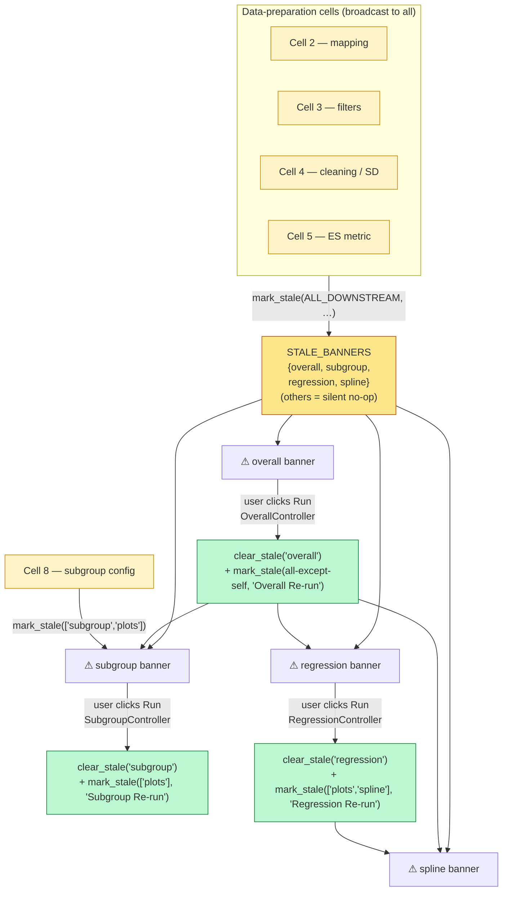
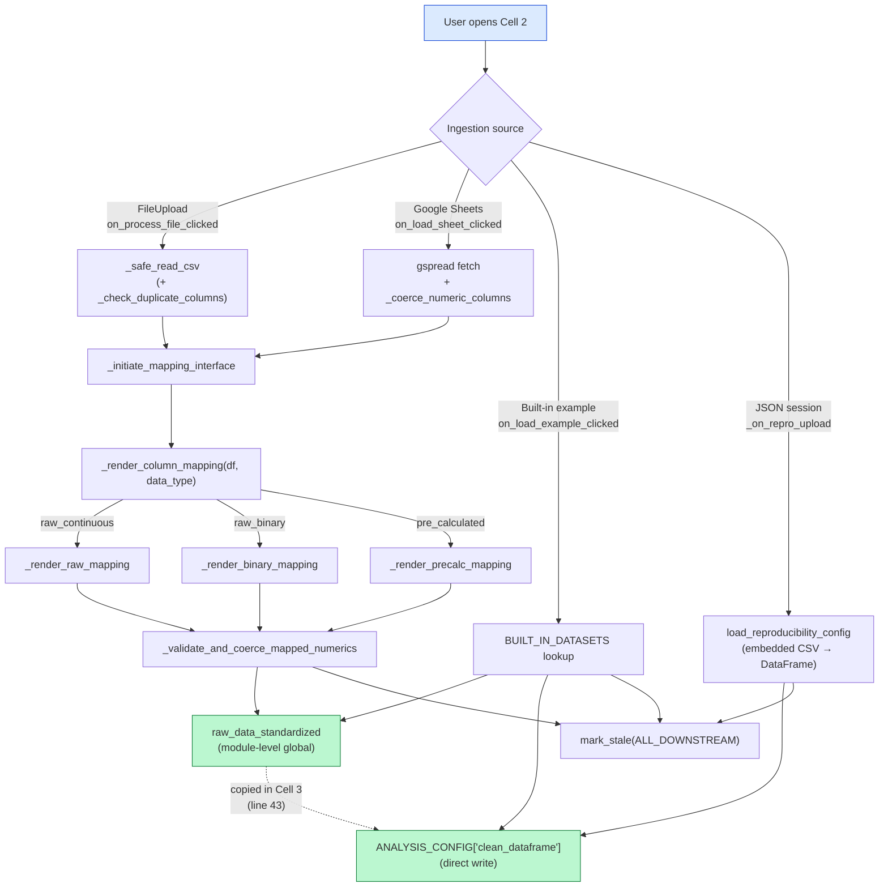
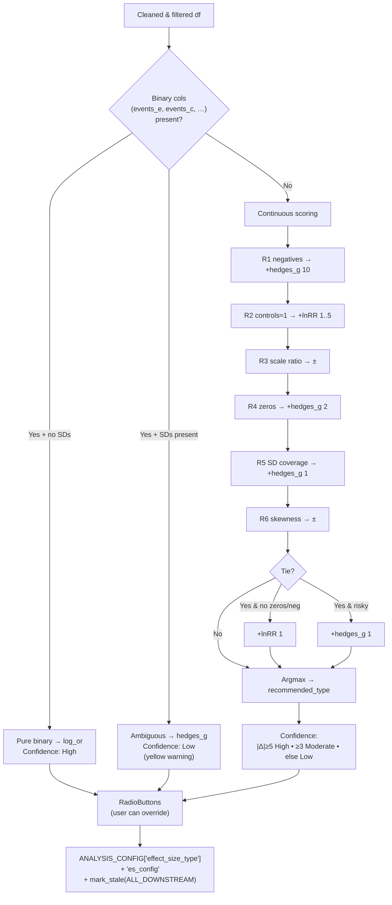
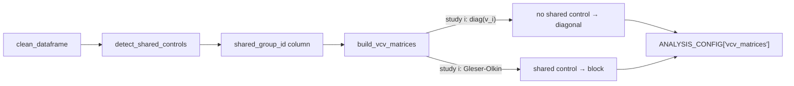
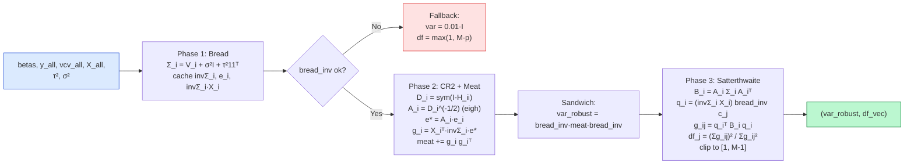
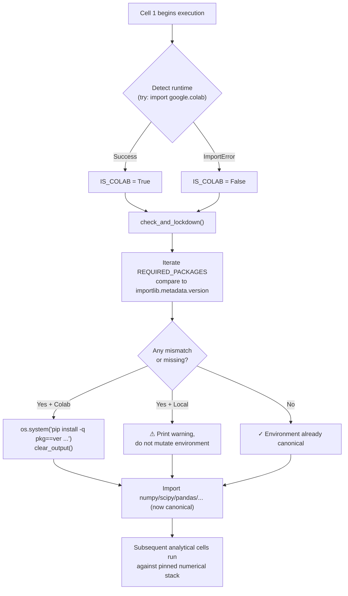
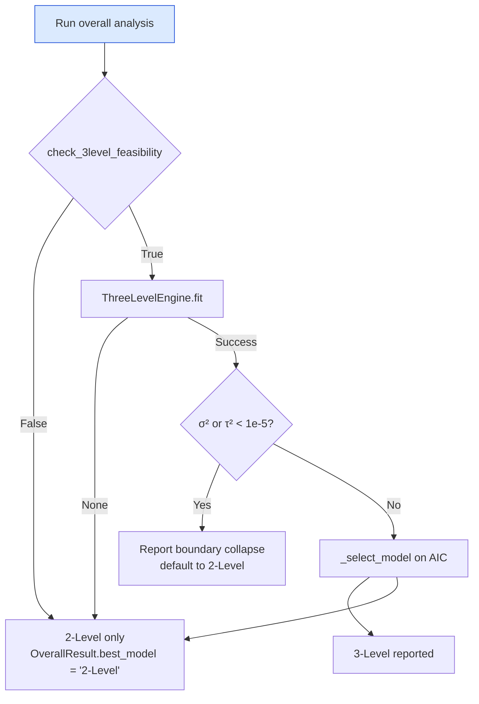
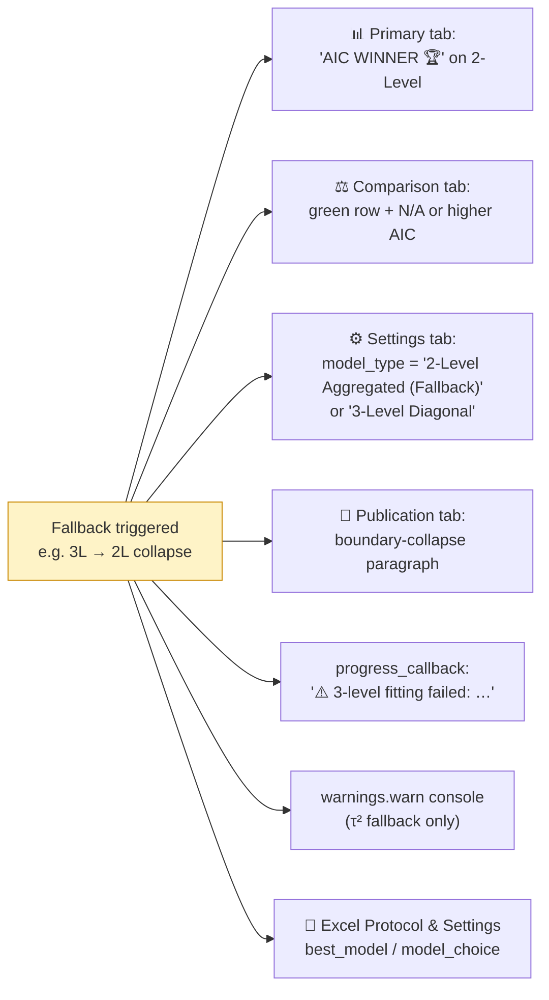
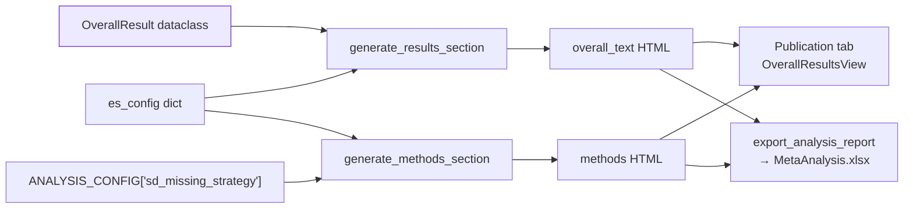

# CoMeta: Architecture and Data Flow

*A technical reference for the `CoMeta_1.ipynb` analytical pipeline.*

---

## 1. System Overview: The Notebook as an Application

CoMeta is implemented as a single linear Google Colab notebook (`CoMeta_1.ipynb`, 44 cells). Despite the notebook format, the codebase adheres to a strict **Model–View–Controller (MVC)** discipline within each analytical module: the *Model* is encapsulated in a `*DataManager`/`*Engine` pair, the *View* in a `*ResultsView` (a `widgets.Tab` renderer), and the *Controller* in a `*Controller` class that wires user widgets to the engine and pushes results into the view. The same triplet recurs in Cells 7 (`OverallDataManager`, `OverallEngine`, `OverallResultsView`, `OverallController`), 9 (`SubgroupDataManager`, `SubgroupAnalysisEngine`, `SubgroupController`), 12 (`RegressionDataManager`, `RegressionEngine`, `RegressionController`), and 14 (`SplineMetaRegressionController`).

### 1.1 Global state: `ANALYSIS_CONFIG`

All cross-cell state lives in a single module-level dictionary, `ANALYSIS_CONFIG`, initialised defensively at the top of every cell:

```python
if 'ANALYSIS_CONFIG' not in globals():
    ANALYSIS_CONFIG = {}
```

This dictionary is the canonical "Model" — every cell reads its inputs from `ANALYSIS_CONFIG` and writes its outputs back to it, ensuring that downstream cells can be executed independently as long as the upstream keys are present. Representative keys (in the order they appear in the pipeline):

| Stage | Key | Producer cell | Type |
|---|---|---|---|
| Ingestion | `clean_dataframe` | 2 | `pd.DataFrame` |
| Filtering | `prefilter_col`, `prefilter_values` | 3 | `str`, `list` |
| Cleaning | `removed_records`, `sd_missing_strategy`, `sd_zero_strategy`, `sd_log` | 4 | mixed |
| Effect sizes | `effect_size_type`, `es_config`, `effect_col`, `var_col`, `se_col` | 5/6 | mixed |
| VCV | `vcv_matrices` | 6 | `dict[study_id → np.ndarray]` |
| Analysis-ready | `analysis_data` | 6 | `pd.DataFrame` |
| Global settings | `global_settings` (`alpha`, `dist_type`, `tau_method`, `use_kh`, `model_choice`) | 7 | `dict` |
| Results | `overall_results`, `three_level_results`, `subgroup_results`, `meta_regression_RVE_results`, `spline_model_results`, `funnel_results`, `trimfill_results`, `pet_peese_results`, `cumulative_results`, `loo_3level_results` | 7–25 | `dict` |
| Generated text | `overall_text`, `subgroup_text`, `regression_text`, `bias_text`, `cumulative_text` | 7–18 | `str` |
| Provenance | `is_reproducing`, `data_type` | 2/end | `bool`/`str` |

Widgets do **not** hold persistent state. Each `*Controller` calls `data_manager.save_global_settings(...)`, `save_overall_results(...)`, etc., which mutates `ANALYSIS_CONFIG` in place.

### 1.2 Staleness propagation

Because the notebook is sequential but the user may re-run any upstream cell, every analytical module registers an `ipywidgets.HTML` *stale banner* via `register_banner(module_id, banner_widget)` (Cell 1, line 117). Three primitives live in Cell 1 (lines 115–143) and constitute the entire mechanism:

```python
STALE_BANNERS = {}

def register_banner(module_id: str, banner_widget: widgets.HTML):
    STALE_BANNERS[module_id] = banner_widget

def mark_stale(module_ids: list, trigger_source: str):
    html_content = "<div ...>⚠️ Stale Results Detected ... Upstream settings for <b>{trigger_source}</b> ...</div>"
    for mod_id in module_ids:
        if mod_id in STALE_BANNERS:        # ← silent no-op for unregistered modules
            STALE_BANNERS[mod_id].value = html_content

def clear_stale(module_id: str):
    if module_id in STALE_BANNERS:
        STALE_BANNERS[module_id].value = ""

ALL_DOWNSTREAM = ['overall', 'subgroup', 'regression', 'spline',
                  'pub_bias', 'pet_peese', 'loo', 'cumulative', 'plots']
```

(`ALL_DOWNSTREAM` is declared at Cell 1, line 145.)

#### Who actually registers a banner

Although `ALL_DOWNSTREAM` lists nine module identifiers, only **four** modules currently instantiate a banner via `self.stale_banner = widgets.HTML(value="")` and call `register_banner`:

| `module_id` | Banner registered in | Line |
|---|---|---|
| `'overall'` | `OverallResultsView.__init__` (Cell 7) | 2065 |
| `'subgroup'` | `SubgroupResultsView.__init__` (Cell 9) | 2858 |
| `'regression'` | `RegressionResultsView.__init__` (Cell 12) | 1594 |
| `'spline'` | `SplineMetaRegressionController.__init__` (Cell 14) | 587 (guarded by `if 'register_banner' in globals():`) |

The remaining five identifiers (`pub_bias`, `pet_peese`, `loo`, `cumulative`, `plots`) are *declared* downstream targets but their owning cells do not (yet) register banners. The `if mod_id in STALE_BANNERS` guard inside `mark_stale` and `clear_stale` makes calls on un-registered IDs a deliberate silent no-op rather than an error — which is what allows callers to broadcast to the entire `ALL_DOWNSTREAM` list without first checking which modules the user has executed.

#### Who triggers staleness, and at what scope

Every call site of `mark_stale` is a *user-action observer* — a widget callback or a controller `on_click` handler. The staleness graph is therefore not "everything downstream from data" but a directed DAG in which each cell broadcasts to precisely the consumers it can invalidate. Audited call sites:

| Trigger cell | Call | Scope |
|---|---|---|
| Cell 2 — `_render_binary_mapping` (l. 965) | `mark_stale(ALL_DOWNSTREAM, "Step 2: Binary Data Mapping Changed")` | full |
| Cell 2 — `_render_raw_mapping` (l. 1064) | `mark_stale(ALL_DOWNSTREAM, "Step 2: Raw Data Mapping Changed")` | full |
| Cell 2 — `_render_precalc_mapping` (l. 1191) | `mark_stale(ALL_DOWNSTREAM, "Step 2: Pre-calculated Data Mapping Changed")` | full |
| Cell 3 — global filter handler (l. 171) | `mark_stale(ALL_DOWNSTREAM, "Step 3: Global Filters Changed")` | full |
| Cell 4 — cleaning handler (l. 662 and l. 839) | `mark_stale(ALL_DOWNSTREAM, "Step 4: Data Cleaning / SD Handling Changed")` | full |
| Cell 5 — `on_proceed` (l. 445) | `mark_stale(ALL_DOWNSTREAM, "Step 5: Effect Size Metric Changed")` | full |
| Cell 7 — `OverallController` after re-run (l. 2623) | `mark_stale(['subgroup','regression','spline','pub_bias','pet_peese','loo','cumulative','plots'], "Overall Meta-Analysis Re-run")` | all-except-self |
| Cell 8 — subgroup configuration handler (l. 504) | `mark_stale(['subgroup', 'plots'], "Step 8: Subgroup Configuration Changed")` | targeted |
| Cell 9 — `SubgroupController` after re-run (l. 3424) | `mark_stale(['plots'], "Subgroup Analysis Re-run")` | targeted |
| Cell 12 — `RegressionController` after re-run (l. 2147) | `mark_stale(['plots', 'spline'], "Meta-Regression Re-run")` | targeted |

Two propagation patterns are visible. **Data-preparation cells (2–5)** broadcast to the full `ALL_DOWNSTREAM` list, because a change to ingestion, filtering, cleaning, or the effect-size metric invalidates *every* downstream result. **Analytical modules (7, 9, 12)** clear their *own* banner with `clear_stale(self_id)` and then immediately call `mark_stale(...)` on the modules they themselves feed — implementing a *cascade* in which re-running the overall analysis stales the subgroup banner, re-running the subgroup analysis stales the plot banners, and so on.

#### Lazy invalidation, not reactive recompute

The banner displays a yellow `⚠️ Stale Results Detected` warning that names the trigger source (e.g. *"Upstream settings for **Step 5: Effect Size Metric Changed** have been modified"*) and instructs the user to press the module's **Run** button. The banner persists until the controller's run handler completes successfully and calls `clear_stale(self_id)` (e.g. Cell 7, line 2622 for `'overall'`; Cell 9 l. 3423; Cell 12 l. 2146). Because the notebook environment lacks a reactive runtime, this constitutes a **lazy invalidation** strategy: results are not auto-recomputed when their inputs change, but the user is never allowed to confuse a stale result with a current one.



---

## 2. Data Ingestion and Initialization (Cell 2)

Cell 2 (`#@title ⚙️ 2. Data Ingestion`) implements four mutually exclusive ingestion pathways behind a single `widgets.Dropdown` data-type selector. The unified output is a validated `pd.DataFrame` written to `ANALYSIS_CONFIG['clean_dataframe']`.

### 2.1 Ingestion pathways

| Source | Trigger | Handler |
|---|---|---|
| CSV / Excel upload | `widgets.FileUpload` → `on_file_upload(change)` → `on_process_file_clicked(b)` | `get_uploaded_file_data(uploader_widget)` extracts bytes, `_safe_read_csv(content_bytes)` parses with encoding fallback |
| Google Sheets | `on_auth_clicked(b)` → `on_fetch_ws_clicked(b)` → `on_load_sheet_clicked(b)` | Uses `gspread` to pull a worksheet by URL/ID |
| JSON session restore | `_on_repro_upload(change)` | Calls `load_reproducibility_config(json_bytes)` (Cell 1, line 2738), re-hydrating `clean_dataframe` from the embedded CSV and setting `is_reproducing=True` |
| Built-in examples | `widgets.Dropdown` populated from `BUILT_IN_DATASETS` → `on_load_example_clicked(b)` | Five hard-coded dictionaries: `BCG_DATA`, `NORMAND_DATA`, `KONST_DATA`, `RAUDENBUSH_DATA`, `CURTIS_DATA` |

The five built-in datasets are declared as Python dicts and exposed through:

```python
BUILT_IN_DATASETS = {
    'Binary (BCG Vaccine - Tuberculosis)':            {'data': BCG_DATA,        'type': 'raw_binary'},
    'Continuous (Normand 1999 - Stroke Rehab)':       {'data': NORMAND_DATA,    'type': 'raw_continuous'},
    '3-Level Pre-Calculated (Konstantopoulos 2011)':  {'data': KONST_DATA,      'type': 'pre_calculated'},
    'Meta-Regression / Splines (Raudenbush 1985)':    {'data': RAUDENBUSH_DATA, 'type': 'pre_calculated'},
    'Ecology Continuous (Curtis 1998 - Plant CO2)':   {'data': CURTIS_DATA,     'type': 'raw_continuous'},
}
```

### 2.2 Column mapping & validation

After loading, three of the four ingestion pathways present a column-mapping interface routed by `_initiate_mapping_interface(df)` → `_render_column_mapping(df, data_type)` to one of three branches:

* `_render_raw_mapping(df)` — continuous raw means/SDs/Ns, governed by the synonym table `RAW_COLUMN_SPECS` (keys: `id, xe, sde, ne, xc, sdc, nc`).
* `_render_binary_mapping(df)` — 2×2 tables, governed by `BINARY_COLUMN_SPECS` (keys: `id, events_e, nonevents_e, events_c, nonevents_c`).
* `_render_precalc_mapping(df)` — pre-calculated effect sizes, governed by `PRECALC_COLUMN_SPECS` (keys: `id, yi, variance, se, n_total`).

Optional geographic columns (`GEO_COLUMN_SPECS`: latitude, longitude, country) are mapped through `_build_geo_mapping_widgets(df)` and validated with `_validate_geo_data(df, geo_map)`.

Validation is split across two ingest-time and one renderer-time check:

1. **`_check_duplicate_columns(df, source_label)`** — invoked at *ingestion* time inside `_safe_read_csv(content_bytes)` (Cell 2, line 311) and inside `on_process_file_clicked` for Excel uploads (line 787). It rejects DataFrames with duplicate column names before they ever reach the mapping UI.
2. **`_validate_and_coerce_mapped_numerics(df, col_map, data_type)`** — invoked inside each renderer (`_render_binary_mapping` line 946, `_render_raw_mapping` line 1047, `_render_precalc_mapping` line 1161). Coerces numerics using the strict whitelist `_NUMERIC_REQUIRED` and the soft whitelist `_NUMERIC_SOFT`.
3. **`_coerce_numeric_columns(df)`** — invoked at *ingestion* time inside `on_load_sheet_clicked` (line 699) so that Google Sheets values (which arrive as strings) are typed before reaching the mapping UI.

On successful mapping the renderer assigns the renamed, type-coerced frame to the **module-level global** `raw_data_standardized` (Cell 2, lines 943 / 1044 / 1158) and sets `DATA_TYPE_SELECTED` to `'raw'` or `'pre_calculated'`. The final commit into `ANALYSIS_CONFIG['clean_dataframe']` happens one cell later, in Cell 3 (line 43), which copies `raw_data_standardized` into the global config dictionary. The two ingestion shortcuts behave differently:

* **Built-in examples** (`on_load_example_clicked`) bypass `_initiate_mapping_interface` entirely — the data columns are already canonical — and write *both* `raw_data_standardized` *and* `ANALYSIS_CONFIG['clean_dataframe']` directly (Cell 2, lines 1426–1437).
* **JSON session restore** (`_on_repro_upload`) hydrates `ANALYSIS_CONFIG['clean_dataframe']` inside `load_reproducibility_config(content)` from the embedded CSV string (§ 5.1), again bypassing the mapping UI.

In every case, after a successful path, the renderer (or the bypass shortcut) calls `mark_stale(ALL_DOWNSTREAM, "Step 2: … Mapping Changed")` to invalidate downstream module banners.



---

## 3. Data Preparation and VCV Matrix Construction

### 3.1 Shared-control detection (Cell 4)

Cell 4 owns `detect_shared_controls(df)`, which flags within-study observations that re-use the same control arm. The function groups by `id` and hashes the control-group signature:

```python
# Continuous data
group['_control_key'] = (
    group['nc'].fillna(-999).astype(str) + '_' +
    group['xc'].fillna(-999).round(6).astype(str) + '_' +
    group['sdc'].fillna(-999).round(6).astype(str)
)
# Binary data
group['_control_key'] = (
    group['events_c'].fillna(-999).astype(str) + '_' +
    group['nonevents_c'].fillna(-999).astype(str)
)
```

Any group of ≥ 2 rows sharing the same key is assigned a unique tag `shared_group_id = f"{study_id}_shared_grp_{group_counter}"`. The function returns `(df, shared_count)`. The detector is invoked from the main cleaning pipeline at line 430 of Cell 4:

```python
data_filtered, n_shared = detect_shared_controls(data_filtered)
```

The resulting `shared_group_id` column is the bridge between data preparation and covariance modelling — it is the *only* signal the VCV builder uses to decide where off-diagonal entries belong.

### 3.2 Missing-SD imputation strategies (Cell 4)

Continuous-data workflows in CoMeta are dependent on usable experimental and control standard deviations (`sde`, `sdc`). When those columns are empty, zero, or partially missing, the `run_processing(df_config, sd_missing_strategy='median_cv', sd_zero_strategy='global_min', custom_cv=None)` orchestrator in Cell 4 dispatches to one of four mutually exclusive **missing-SD strategies**, paired independently with one of three **zero-SD strategies**. Both choices are exposed in the Cell 4 UI as `widgets.Dropdown` objects and are persisted to `ANALYSIS_CONFIG['sd_missing_strategy']`, `ANALYSIS_CONFIG['sd_zero_strategy']`, and `ANALYSIS_CONFIG['custom_cv']`.

#### 3.2.1 The four missing-SD strategies

| Strategy key | Implementing function (Cell 4) | Formula / behaviour |
|---|---|---|
| `'nearest'` | `impute_sd_nearest_neighbor(df, sd_col, n_col, mean_col)` (line 97) | For each NaN row, find the row with the *closest* sample size (`np.argmin(np.abs(valid_ns − target_n))`) that has a valid SD and copy its SD value. Mean column is unused (kept for API consistency). |
| `'median_cv'` *(default)* | `impute_sd_median_cv(df, sd_col, n_col, mean_col)` (line 141) | Compute `median_cv = median(sd_col / mean_col)` over rows where both are positive (fallback `median_cv = 0.1` if none exist). Imputed value: `sd = |mean| × median_cv`. Rows with missing means stay `NaN`. |
| `'custom_cv'` | `impute_sd_custom_cv(df, sd_col, n_col, mean_col, custom_cv)` (line 181) | Same formula as `median_cv` but with the user-supplied `ANALYSIS_CONFIG['custom_cv']` (fallback 0.1 if `None`). |
| `'drop'` | inline in `run_processing`, line 391–397 | Drop every row where `sde` or `sdc` is `NaN`. The dropped slice is tagged `dropped['Reason'] = 'Missing Standard Deviation'` and appended to `removed_records`, which is concatenated into `ANALYSIS_CONFIG['removed_records']` at the end of the pipeline. |

A parallel three-way dispatch handles **zero** SDs *before* the missing-value pass, because the zero strategy can convert zeros into `NaN`s for the imputer to pick up:

| `sd_zero_strategy` | Action |
|---|---|
| `'global_min'` *(default)* | `replace_zero_sd_global_min(df, sd_col)` (line 213): replace zeros with `nonzero_sds.min()`; absolute fallback `0.001`. |
| `'same_as_missing'` | Convert zeros to `NaN` so the missing-SD imputer handles them with whichever strategy is selected. |
| `'drop'` | Drop the offending rows and tag them `dropped['Reason'] = 'Zero Standard Deviation'`. |

#### 3.2.2 How imputed values are flagged for the Excel audit trail

CoMeta tracks imputation provenance through **four parallel mechanisms** that together feed the downstream audit sheets:

1. **`ANALYSIS_CONFIG['sd_log']`** — A list of human-readable strings appended inline as each branch runs. Examples that appear *verbatim* in the log:

   ```
   Imputed 7 Exp SDs using median CV (0.2143)
   Imputed 7 Ctl SDs using median CV (0.1879)
   Replaced 2 zero Exp SDs with global minimum (0.0040)
   Removed 5 rows with missing SDs
   ```

   Each branch (`'nearest'`, `'median_cv'`, `'custom_cv'`) explicitly logs the *count* of affected rows and the *parameter value* used (e.g. the empirical median CV) so the audit trail is fully self-contained.

2. **`ANALYSIS_CONFIG['removed_records']`** — A concatenated `pd.DataFrame` carrying every row that was dropped, with a `Reason` column distinguishing `'Zero Standard Deviation'`, `'Missing Standard Deviation'`, `'Double-Zero Event Count (Uninformative)'`, and user-filter reasons. The Excel exporter exposes this directly:

   ```python
   def _get_exclusion_log():
       if 'ANALYSIS_CONFIG' in globals() and 'removed_records' in ANALYSIS_CONFIG:
           return ANALYSIS_CONFIG['removed_records']
       return pd.DataFrame([{'ID': 'All Data Kept', 'Reason': 'No records were removed.'}])
   ```

   `export_analysis_report(...)` (Cell 1, line 2397) writes the returned frame to the `Data Exclusions` worksheet:

   ```python
   df_excl = _get_exclusion_log()
   df_excl.to_excel(writer, sheet_name='Data Exclusions', index=False)
   ```

3. **`sde_imputed` / `sdc_imputed` columns on the analysis dataframe** — Cell 6 creates dedicated post-imputation copies the moment the effect-size pipeline begins (`build_vcv_matrices`/effect-size calculator, line 248–249):

   ```python
   if 'sde' in df.columns: df['sde_imputed'] = df['sde']
   if 'sdc' in df.columns: df['sdc_imputed'] = df['sdc']
   ```

   Every subsequent formula references these columns instead of `sde`/`sdc` (e.g. lnRR variance at line 315: `df['sde_imputed']**2 / (df['ne']*df['xe']**2) + …`), so the original input columns remain untouched and the user can compare `sde` vs `sde_imputed` row-by-row in the `Processed Data` sheet of the exported workbook. The VCV builder is also imputation-aware: in `build_vcv_matrices` (line 102) it preferentially reads `sdc_imputed` when present:

   ```python
   sdc_column = 'sdc_imputed' if 'sdc_imputed' in shared_rows.columns else sdc_col
   ```

4. **`Protocol & Settings` worksheet** — `_get_protocol_metadata(report_type)` (Cell 1, line 2274) reads `ANALYSIS_CONFIG.get('sd_missing_strategy')` and records the chosen method so the analyst can recover the exact strategy from any historical report. The publication-text generator goes one step further — `OverallPublicationTextGenerator.generate_methods_section` (Cell 7, line 1756) consults the same key and appends an explicit caveat to the Methods narrative:

   > *"Missing standard deviations were imputed using the median coefficient of variation (CV) from available data. It should be noted that treating imputed variances as known parameters may slightly underestimate the true uncertainty of those specific effect sizes."*

Together, these four mechanisms guarantee that **every imputation event is recoverable** from the exported Excel report alone: the count and parameter from `sd_log`, the per-row dropped data from `Data Exclusions`, the imputed numerical values from `sde_imputed`/`sdc_imputed` in `Processed Data`, and the configured strategy from `Protocol & Settings`.

### 3.3 Rule-based effect-size recommendation (Cell 5)

Cell 5 (`#@title 🔬 5. Effect Size Selection & Diagnostics`) does *not* fit a model — it diagnoses the prepared dataframe and proposes the most defensible effect-size metric. The logic operates in two stages: a topology-based **hard router** that decides whether the data are continuous, pure binary, or ambiguous, followed by a continuous-data **weighted scoring** algorithm that picks between `lnRR` and `hedges_g`. The user is always free to override the recommendation via a `widgets.RadioButtons` selector, but the *recommended* type is highlighted and pre-selected.

#### 3.3.1 Effect-size catalogue

The notebook supports six effect-size metrics, each backed by its own `es_config` dict (Cell 5, lines 343–414 for raw mode; 578–615 for pre-calculated mode):

| Key | `effect_label` | `effect_col` / `var_col` | Data domain | Auto-recommendable? |
|---|---|---|---|---|
| `'lnRR'` | log Response Ratio | `lnRR` / `var_lnRR` | continuous, strictly positive | ✅ (continuous router) |
| `'hedges_g'` | Hedges' g (corrected SMD) | `hedges_g` / `Vg` | continuous, any sign | ✅ (continuous router) |
| `'cohen_d'` | Cohen's d (uncorrected SMD) | `cohen_d` / `Vd` | continuous, any sign | ⚠️ manual only |
| `'log_or'` | log Odds Ratio | `log_OR` / `var_log_OR` | binary 2×2 | ✅ (binary short-circuit) |
| `'log_rr'` | log Risk Ratio | `log_RR` / `var_log_RR` | binary 2×2, when absolute risk matters | ⚠️ user choice within the binary branch |
| `'fisher_z'` | Fisher's z | `fisher_z` / `var_fisher_z` | pre-calculated correlations | ⚠️ manual, pre-calc mode only |

> **Note.** The codebase implements `log_rr` as the log of the *risk ratio* (also called *relative risk*) and does **not** implement a standalone *risk difference* metric — clinical RD is therefore reachable only by selecting `log_rr` and back-transforming downstream.

#### 3.3.2 Stage 1 — Topology-based hard routing

The first block of Cell 5 (lines 25–67) inspects the prepared `data_filtered` (or `raw_data_standardized` as a fallback) and classifies the dataset:

```python
binary_cols = ['events_e', 'nonevents_e', 'events_c', 'nonevents_c']
has_binary_cols     = all(c in target_df.columns for c in binary_cols)
has_continuous_cols = all(c in target_df.columns for c in ['xe', 'xc'])
has_sd_cols         = (... sde or sdc has any non-null ...)

if has_binary_cols:
    is_valid_binary = (binary_data >= 0).all().all() and \
                      (binary_data == binary_data.round(0)).all().all()
    if is_valid_binary and has_continuous_cols and has_sd_cols:
        _binary_data_detected = 'mixed'           # → recommend hedges_g, low confidence
    elif is_valid_binary and not has_sd_cols:
        _binary_data_detected = 'pure'            # → recommend log_or, high confidence
```

The hard router therefore produces three exclusive outcomes:

| Detected topology | Recommendation | Confidence | Scoring runs? |
|---|---|---|---|
| **Pure binary** — only `events_*`/`nonevents_*` columns, all non-negative integers | `log_or` | `High` | No |
| **Mixed/ambiguous** — both binary *and* continuous SD columns present | `hedges_g` (placeholder) | `Low` | No (yellow warning banner displayed) |
| **Continuous only** — `xe`, `xc` (± `sde`, `sdc`) | scored (see §3.3.3) | depends on margin | Yes |

#### 3.3.3 Stage 2 — Weighted scoring (`lnRR` vs `hedges_g`)

When the topology is continuous, Cell 5 computes a battery of summary statistics on `target_df` (`xe.describe()`, `xc.describe()`, skewness, scale ratio, SD coverage, fraction of controls near unity) and applies six additive scoring rules to two accumulators, `score_lnRR` and `score_hedges_g`. Each rule both updates the score *and* appends a diagnostic tuple `(label, weight_marker, recommended_metric, rationale)` to a `reasons` list that is later rendered in the **🧠 Decision Logic** tab.

| Rule (Cell 5, lines 119–168) | Trigger | Effect on score |
|---|---|---|
| **R1 — Negative values (hard constraint)** | `(target_df['xe'] < 0).sum() > 0` or same for `xc` | `score_hedges_g += 10` (else `score_lnRR += 2`) |
| **R2 — Normalisation / fold-change** | `pct_control_exactly_one > 50` → `score_lnRR += 5`; `pct_control_near_one > 30` (`0.95 ≤ xc ≤ 1.05`) → `+= 3`; `0.8 < mean(xc) < 1.2` → `+= 1` | `score_lnRR` |
| **R3 — Scale heterogeneity** | `scale_ratio = max(range_xe, range_xc) / (min + 1e-4)`; `> 100` → `score_lnRR += 3`; `> 10` → `+= 2`; else `score_hedges_g += 1` | depends |
| **R4 — Zero values** | any `xe == 0` or `xc == 0` | `score_hedges_g += 2` (rationale: `log(0)` undefined) |
| **R5 — SD coverage** | `sd_pct = SDs_present / total × 100`; `> 80` → `score_hedges_g += 1`; `< 20` → emits a warning row (no score change) | `score_hedges_g` |
| **R6 — Distribution shape (skewness)** | `max(skew_xe, skew_xc) > 1.5` → `score_lnRR += 2`; `−0.5 < max_skew < 0.5` → `score_hedges_g += 1` | depends |

After R1–R6, a **smart tie-breaker** fires when `score_lnRR == score_hedges_g`:

```python
if score_lnRR == score_hedges_g:
    if not has_negative and not has_zero:
        score_lnRR    += 1   # prefer lnRR for strictly-positive ecological data
    else:
        score_hedges_g += 1  # safer mathematical choice when zeros/negatives lurk
```

The winner becomes `recommended_type`, and the **confidence label** is derived from the absolute score gap:

```python
score_diff = abs(score_lnRR - score_hedges_g)
confidence = "High"     if score_diff >= 5 \
        else "Moderate" if score_diff >= 3 \
        else "Low"
```

#### 3.3.4 Persisting the decision

When the user clicks **✓ Confirm Selection**, `on_proceed(b)` (Cell 5, line 421) commits the chosen metric to global state:

```python
ANALYSIS_CONFIG['effect_size_type'] = sel
ANALYSIS_CONFIG['es_config']        = es_configs[sel]
ANALYSIS_CONFIG['data_type']        = 'raw'
ANALYSIS_CONFIG['effect_col']       = es_configs[sel]['effect_col']
ANALYSIS_CONFIG['var_col']          = es_configs[sel]['var_col']
ANALYSIS_CONFIG['se_col']           = es_configs[sel]['se_col']
mark_stale(ALL_DOWNSTREAM, "Step 5: Effect Size Metric Changed")
```

The downstream calculator in Cell 6 reads these keys to dispatch the correct formula branch (lnRR, hedges_g, cohen_d, log_or, log_rr, fisher_z). The handshake is one-directional: Cell 5 *recommends*, Cell 6 *computes* — the metric can be silently overridden by editing `ANALYSIS_CONFIG['effect_size_type']` (the path taken by `load_reproducibility_config` when restoring a session). Because the call to `mark_stale(ALL_DOWNSTREAM, …)` is unconditional, every change re-arms the warning banners across all downstream cells.



### 3.4 Exact VCV construction (Cell 6 — `build_vcv_matrices`)

Cell 6 contains the closed-form Variance–Covariance constructor, declared in the source as:

> *"Construct variance–covariance (VCV) matrices for studies with shared control groups, using the exact formulae from Gleser & Olkin (2009)."*

```python
def build_vcv_matrices(df, effect_type, var_col_name,
                       yi_col='yi', nt_col='ne', nc_col='nc',
                       xc_col='xc', sdc_col='sdc',
                       events_c_col=None, nonevents_c_col=None):
```

The builder produces one block per `id`. Each study's block is initialised as a **diagonal matrix** of sampling variances (`np.diag(study_grp[var_col_name].values)`). It then iterates over rows whose `shared_group_id` is non-null and inserts the analytically derived covariance into every off-diagonal pair *(i, j)* within that shared cluster. Five closed-form covariances are implemented (Gleser & Olkin 2009, Table 4 and the response-ratio derivation of Lajeunesse 2011):

| `effect_type` | Off-diagonal covariance |
|---|---|
| `cohen_d` | `cov(d_i, d_j) = 1/nc + d_i·d_j·nc / (2·N_i·N_j)` where `N_i = nt_i + nc` |
| `hedges_g` | `J_i·J_j · [ 1/nc + (d_i·d_j·nc) / (2·N_i·N_j) ]` with `J = exp(gammaln(df/2) − ½·log(df/2) − gammaln((df−1)/2))` from `_hedges_j(df_val)` |
| `lnRR` | `sdc² / (nc · xc²)` |
| `log_or` | `1/c_c + 1/d_c` (shared control events / non-events) |
| `log_rr` | `1/c_c − 1/n_c` (shared control events / total) |

#### 3.4.1 Anatomy of a study block

For a study *s* with `k = len(study_grp)` effect sizes, the algorithm proceeds in three deterministic steps (Cell 6, lines 74–177):

1. **Block initialisation.** The diagonal is seeded with the per-row sampling variances drawn from the already-computed effect-size variance column (`var_col_name`, which resolves to `var_lnRR` for response-ratio workflows):
   ```python
   vcv = np.diag(study_grp[var_col_name].values.astype(float))
   ```
   This guarantees that — in the absence of any shared-control structure — the block degenerates to the classical independent-sampling variances.
2. **Shared-cluster enumeration.** The builder groups rows by the `shared_group_id` tag set in Cell 4 (§ 3.1). Singletons (`len(positions) < 2`) are skipped because they generate no off-diagonal entries; only clusters of two or more co-dependent rows trigger covariance insertion. The within-study row indices are recovered via `positions = [indices.index(idx) for idx in shared_rows.index]`, allowing the algorithm to address the local *(i, j)* entries of `vcv` without confusing them with the global dataframe index.
3. **Symmetric covariance insertion.** For every ordered pair *(i, j)* with `i ≠ j` inside the cluster, the appropriate Gleser–Olkin / Lajeunesse closed-form covariance is computed and assigned. Diagonal entries are left untouched (they already carry the per-row variances), preserving the standard sampling variance whilst introducing the dependence structure off-diagonal:
   ```python
   for i in positions:
       for j in positions:
           if i != j:
               vcv[i, j] = cov
   ```

Because the off-diagonal entry is assigned symmetrically across both *(i, j)* and *(j, i)*, the resulting block is exactly symmetric by construction and does not require post-hoc symmetrisation. Rows outside any shared-control cluster preserve their zero off-diagonal entries, yielding a *partially block-diagonal* matrix in which dependence is restricted to genuinely co-dependent observations.

#### 3.4.2 The lnRR off-diagonal: derivation and implementation

For the log response ratio, CoMeta uses the closed-form shared-control covariance derived in **Lajeunesse (2011)** (see Appendix B). For two effect sizes *i* and *j* within the same study that share a common control arm of size `nc`, control mean `xc`, and control standard deviation `sdc`, the covariance between their lnRR estimates is

$$
\mathrm{Cov}\!\bigl(\ln \mathrm{RR}_i,\, \ln \mathrm{RR}_j\bigr) \;=\; \frac{s_C^{2}}{n_C \, \bar X_C^{2}}
$$

This identity follows directly from the delta-method linearisation of lnRR around the control mean. Recall that for treatment mean `xe` and control mean `xc`,
$$
\ln \mathrm{RR} \;=\; \ln \bar X_E - \ln \bar X_C, \qquad
\mathrm{Var}(\ln \mathrm{RR}) \;=\; \frac{s_E^{2}}{n_E \bar X_E^{2}} + \frac{s_C^{2}}{n_C \bar X_C^{2}}.
$$

The first term is *idiosyncratic* to each treatment arm and is therefore independent across effect sizes *i* and *j* — even when those effect sizes are nested within the same study. The second term, however, is **identical** for every effect size that draws on the same control mean. Substituting two effect sizes that share `(xc, sdc, nc)` into the delta-method variance and retaining only the *common* terms yields the covariance formula above. In other words, the off-diagonal entry for a pair of lnRR effect sizes that share a control arm is exactly the *control-arm contribution* to their individual sampling variances — the part of the variance that would otherwise be double-counted if the effect sizes were naïvely treated as independent.

The implementation faithfully translates this derivation (Cell 6, lines 99–106):

```python
# ── lnRR ─────────────────────────────────────────────
if effect_type == 'lnRR' and xc_col in shared_rows.columns:
    xc = float(shared_rows.iloc[0][xc_col])
    sdc_column = 'sdc_imputed' if 'sdc_imputed' in shared_rows.columns else sdc_col
    sdc = float(shared_rows.iloc[0][sdc_column]) if sdc_column in shared_rows.columns else 0.0

    cov = (sdc ** 2) / (nc * xc ** 2) if xc != 0 else 0.0

    for i in positions:
        for j in positions:
            if i != j:
                vcv[i, j] = cov
```

Several engineering choices in this snippet are worth flagging for methodologists auditing the implementation:

- **Imputation-aware SD.** Rather than reading `sdc` directly, the routine preferentially reads `sdc_imputed` whenever that column has been generated by the SD-handling pipeline (§ 3.2). This guarantees that — if a row's control SD was imputed via `median_cv`, `custom_cv`, or `nearest`-neighbour — the *imputed* value, not the original `NaN`, is propagated into the covariance term. The substitution is intentional: a missing or zero `sdc` would otherwise drive the off-diagonal entry to zero and would silently dissolve the very dependence structure CoMeta is attempting to model.
- **Single representative row.** Because every member of the shared-control cluster is, by definition of `shared_group_id`, expected to carry identical `(xc, sdc, nc)` triples, the implementation reads these values from the first row of the cluster (`shared_rows.iloc[0]`). The shared-control detector in Cell 4 (§ 3.1) constructs the `shared_group_id` precisely so that this invariant holds — the cluster key is built by hashing `nc / xc / sdc` to six decimal places.
- **Zero-mean guard.** If `xc == 0` the divisor would diverge; the routine returns `cov = 0.0` in that boundary case. Such rows should already have been removed or offset in Cell 6's `lnRR` pre-processing block (which adds a scale-adjusted offset to any zero `xe`/`xc` and removes negatives), so this branch is a defence-in-depth guard rather than an expected code path.
- **Constant covariance across the cluster.** The covariance `(sdc²)/(nc · xc²)` is computed once and assigned to every off-diagonal pair in the cluster. This is the correct behaviour: under shared controls, *all* pairs of effect sizes share the same control-arm uncertainty, so the off-diagonal block is uniform with magnitude exactly equal to the squared standard error of `ln(xc)`.

#### 3.4.3 Interpretation and downstream consumption

The resulting block has a particularly transparent interpretation. For a study contributing `k` effect sizes that all share a common control,

$$
V_s^{\text{lnRR}} \;=\;
\underbrace{\mathrm{diag}\!\bigl(v_1, v_2, \dots, v_k\bigr)}_{\text{independent treatment-arm contributions}}
\;+\;
\underbrace{c \cdot \mathbf{1}\mathbf{1}^{\!\top} \;-\; c \cdot \mathbf{I}_k}_{\text{shared-control contribution (off-diagonal only)}},
\qquad c \;=\; \tfrac{s_C^{2}}{n_C \, \bar X_C^{2}},
$$

where `v_i = sde_i²/(ne_i · xe_i²) + c` is the marginal variance already on the diagonal (computed earlier in Cell 6's lnRR branch) and the second term injects the cluster-uniform off-diagonal *c* without touching the diagonal. This block is then keyed by `study_id` into the `vcv_matrices` dictionary and consumed downstream by `ThreeLevelEngine.fit` and `_run_three_level_reml_regression_v2` (§ 4.2–4.3), where it is folded into the per-study covariance Σᵢ = `V_i + σ²·I_k + τ²·1·1ᵀ`. Because the lnRR block already carries a rank-one shared-control structure on the off-diagonal, the matrix path of the REML optimiser (Cholesky branch, § 4.2) — rather than the Sherman–Morrison fast path — is what actually executes for studies with shared controls; this is exactly the regime the analytic Gleser–Olkin / Lajeunesse derivation was developed to license.

The output is a dictionary keyed by `study_id`:

```python
vcv_matrices = {}
...
vcv_matrices[study_id] = vcv     # np.ndarray, shape (k_i, k_i)
return vcv_matrices
```

`build_vcv_matrices` is called once at the end of Cell 6 and persisted globally:

```python
vcv_matrices = build_vcv_matrices(df, effect_size_type, var_col, **vcv_kwargs)
ANALYSIS_CONFIG['vcv_matrices'] = vcv_matrices
ANALYSIS_CONFIG['analysis_data'] = df
```

Studies that never matched a `shared_group_id` retain the pure-diagonal block, and pre-calculated workflows missing the raw count columns silently fall back to the diagonal identity (line 67 of Cell 6) — these are the only conditions under which the block deviates from the exact Gleser–Olkin form.

The full block-diagonal *VCV matrix* of the dataset is never instantiated as a single `(N × N)` array; the engine operates on the per-study list in study-order, which makes Sherman–Morrison and Cholesky shortcuts cheap (see § 4.2).



---

## 4. The Statistical Engine Flow (Cells 1 + 7 + 12)

The statistical core is split between **Cell 1** (low-level math primitives, REML log-likelihoods, robust SE) and **Cell 7** (orchestration, model selection, reporting). Cells 9 (subgroup), 12 (meta-regression) and 14 (splines) re-use the same primitives.

### 4.1 Three-level orchestration (`OverallEngine.run_analysis`)

The orchestrator follows a deterministic, five-step workflow declared in the source as `WORKFLOW: 1. Prepare data; 2. Fixed-effect analysis; 3. Heterogeneity statistics; 4. 2-level random-effects; 5. 3-level random-effects (if feasible); 6. Model selection.` Each step is gated by an optional `progress_callback(message)` hook (currently wired to a no-op in `OverallController.run_analysis`, but exposed so that a future status widget can attach without engine changes — see § 4.5.1).

**Signature.** `run_analysis(alpha=0.05, dist_type='t', use_kh=True, tau_method='REML', model_choice='Auto-Select (Best AIC)', match_r_ll=False, progress_callback=None) -> Optional[OverallResult]`. The defaults match the manuscript's canonical configuration; `match_r_ll=True` adds the constant `−0.5·k·log(2π)` to the REML log-likelihood (and a matching update to `aic = 6 − 2·log_lik`) so that values are byte-identical with `metafor::rma.mv` for validation cross-checks (§ Validation cells 26–43).

**Step-by-step.**

| # | Step | Implementation (Cell 7 line) | Output |
|---|---|---|---|
| 1 | Prepare data | `df = self.data_manager.prepare_data()` (l. 1163) — drops `NaN`s in effect/var columns, removes `var ≤ 0`. Failure → returns `None`. | clean `df`, `y`, `v`, `k_obs`, `k_studies` |
| 2 | Fixed-effect | `fe_results = self.fixed_engine.calculate(y, v, alpha, dist_type)` (l. 1178) | `mu_fixed`, `se_fixed`, `ci_*_fixed` |
| 3 | Heterogeneity | `Q, df_Q, p_Q = self.het_engine.calculate_Q_statistics(y, v, fe_results['mu'])` + `I2 = self.het_engine.calculate_I2(Q, df_Q)` (l. 1183–1184) | `Q`, `df_Q`, `p_Q`, `I²` |
| 4 | 2-level RE | `TwoLevelEngine(tau_method=tau_method)` → `.estimate_tau2(df, …)` (dispatches to `calculate_tau_squared` for REML/ML or `calculate_tau2_DL` for DL; falls back to DL on failure with `warnings.warn`) → `.calculate_pooled_effect(y, v, tau2, alpha, dist_type, use_kh, k_studies)` → `.calculate_loglik_aic(y, v, tau2, match_r_ll)` (l. 1190–1204) | `tau²`, `re_results`, `ll_2l`, `aic_2l` |
| 5 | 3-level RE *(conditional)* | Gated on `self.data_manager.check_3level_feasibility(df)` (l. 1209). When `True`: `three_level_results = self.three_level_engine.fit(df, effect_col, var_col, vcv_matrices)` (l. 1213–1218). Adds `match_r_ll` constant if requested; computes `ci_lower/upper/p_value` for the 3-level mean using `t.ppf` / `norm.ppf` depending on `dist_type` and `df_3l = k_studies − 1`. Optimiser failure → `has_3level = False`, optimiser exception → caught and progress-stream `"⚠️ 3-level fitting failed: {e}"`. | `mu_3l`, `tau²_3l`, `σ²_3l`, ICCs, profile CIs, `aic_3l` |
| 6 | Model selection | `best_model = self._select_model(model_choice, aic_2l, aic_3l, sigma2_3l, tau2_3l)` (l. 1255) | `'2-Level'` or `'3-Level'` |
| 7 | Result assembly | Constructs the `OverallResult` dataclass (Cell 7 l. 52–115) with FE / 2L / 3L blocks and persists via `OverallDataManager.save_overall_results(result)` → `ANALYSIS_CONFIG['overall_results']` and `ANALYSIS_CONFIG['three_level_results']`. | `OverallResult` |

**Structure-aware model selection.** `_select_model(model_choice, aic_2l, aic_3l, sigma2_3l, tau2_3l)` (Cell 7, l. 1337) is *not* a pure AIC tournament. It applies, in order:

1. **Hard overrides.** `model_choice == 'Force 2-Level'` → return `"2-Level"`; `model_choice == 'Force 3-Level'` → return `"3-Level"` if `aic_3l is not None` else `"2-Level"`.
2. **Three-level availability.** If `aic_3l is None` (feasibility failed or optimiser returned `None`) → `"2-Level"`.
3. **Parameter-boundary check.** If `sigma2_3l < 1e-5` or `tau2_3l < 1e-5` → `"2-Level"`. This is the **boundary-collapse rule** surfaced verbatim in the publication-text generator (§ 4.5.1, item 4) — preventing the engine from reporting a 3-level model that degenerated into a 2-level model under variance partitioning.
4. **Parsimony check.** Return `"3-Level"` only if `aic_3l < aic_2l − 3` (i.e. ΔAIC ≥ 3 in favour of the 3-level fit). Otherwise return `"2-Level"`. The 3-unit margin is a documented design choice: a marginal AIC improvement is not allowed to override the simpler model.

```mermaid
sequenceDiagram
    autonumber
    participant UI as run_overall_meta_analysis
    participant Ctl as OverallController
    participant DM as OverallDataManager
    participant Eng as OverallEngine
    participant FE as FixedEffectEngine
    participant HE as HeterogeneityEngine
    participant T2 as TwoLevelEngine
    participant T3 as ThreeLevelEngine
    participant View as OverallResultsView

    UI->>Ctl: OverallController(ANALYSIS_CONFIG)
    Ctl->>DM: __init__ and _validate_prerequisites
    Ctl->>Eng: OverallEngine(DM) plus FE, HE, T3 sub-engines
    UI->>Ctl: run_analysis (reads widgets)
    Ctl->>DM: save_global_settings(alpha, dist_type, tau_method, use_kh, model_choice)
    Ctl->>Eng: run_analysis(...)
    Eng->>DM: prepare_data (dropna, var greater than 0)
    Eng->>FE: calculate(y, v, alpha, dist_type)
    Eng->>HE: calculate_Q_statistics and calculate_I2
    Eng->>T2: TwoLevelEngine(tau_method) then estimate_tau2, calculate_pooled_effect, calculate_loglik_aic
    Note over Eng,T2: tau-squared fallback REML or ML to DL via warnings.warn
    alt check_3level_feasibility(df) is True
        Eng->>T3: fit(df, effect_col, var_col, vcv_matrices)
        T3-->>Eng: dict or None
        Note over Eng: if match_r_ll then add -0.5 k log(2 pi) constant; aic = 6 minus 2 log_lik
        Eng->>Eng: compute ci_lower, ci_upper, p_value (t or norm, df = k_studies - 1)
    end
    Eng->>Eng: _select_model (overrides, availability, boundary, delta-AIC at least 3)
    Eng-->>Ctl: OverallResult
    Ctl->>DM: save_overall_results(result) into ANALYSIS_CONFIG
    Ctl->>View: render_primary_tab, render_comparison_tab, render_publication_tab
```

### 4.2 Three-level REML core (`ThreeLevelEngine.fit`, Cell 7 lines 740–1098)

`fit(df, effect_col, var_col, vcv_dict)` consumes the analysis dataframe, the effect / variance column names, and the VCV dictionary keyed by `study_id`. It returns either a dictionary with the fitted parameters or `None` if optimisation completely fails (caught by `OverallEngine.run_analysis` to set `has_3level = False`).

**Data preparation.**

1. **Deterministic ordering.** `df = df.sort_values('id').reset_index(drop=True)` — the source comment is `# 1. CRITICAL: Sort to ensure alignment with VCV construction order` (l. 778). The optimiser indexes per-study `y_all[i]` and `vcv_all[i]` in parallel, so any reshuffling between data-prep and fit would produce a silently wrong result.
2. **Robust VCV key lookup.** For each study group the lookup tries `str(study_id)` first, then the raw `study_id` (l. 788–795), so a study indexed as the integer `42` in the dataframe will still find a VCV matrix keyed as the string `'42'` (and vice versa). When neither key matches, the engine **falls back to a per-row diagonal** `np.diag(vi)` after a `NaN`/empty-vector validation pass — raising `ValueError(f"Invalid variance data for study {study_id}")` if the input is unusable.
3. **Cardinality check.** `if len(y_all) != len(vcv_all): raise ValueError(...)` (l. 803) — guarantees the optimiser cannot be entered with a misaligned per-study list.

**Per-study covariance.** For each study *i* the marginal covariance is

$$
\Sigma_i \;=\; V_i \;+\; \sigma^2 \, I_k \;+\; \tau^2 \, \mathbf{1}\mathbf{1}^{\!\top}
$$

The implementation chooses between two execution paths via `is_diag = (k == 1) or np.allclose(V_i, np.diag(np.diag(V_i)))` (l. 832):

| Path | Trigger | Math |
|---|---|---|
| Sherman–Morrison (closed-form) | `k == 1` *or* `V_i` is exactly diagonal (no shared control in study *i*) | `A_inv = 1/(v + σ²)`, `denom = 1 + τ²·sum(A_inv)`, then `w_y = A_inv·y − (τ²·A_inv·sum(A_inv·y))/denom` and `w_1 = A_inv − (τ²·A_inv·sum(A_inv))/denom`. Avoids any matrix factorisation. |
| Cholesky (full matrix) | `V_i` has off-diagonal entries (shared-control block from § 3.4) | `Σ_i = V_i.copy(); np.fill_diagonal(Σ_i, diag(Σ_i)+σ²); Σ_i += τ²` then `L = np.linalg.cholesky(Σ_i)`; `log_det = 2·sum(log(diag(L)))`; `A_inv_mat = np.linalg.inv(Σ_i)`. **Fallback:** on `np.linalg.LinAlgError` the routine substitutes `np.linalg.pinv(Σ_i)` and `np.linalg.slogdet(Σ_i)` for the log-determinant. |

**Optimisation.** The negative REML log-likelihood `nll(params)` profiles the pooled mean μ analytically (μ = `sum_Sy / sum_S`) so the optimiser searches only over two non-negative parameters `(τ², σ²)`. Convergence uses a **deterministic six-start L-BFGS-B**:

```python
start_points = [[0.01, 0.01], [0.1, 0.1], [0.5, 0.5],
                [1.0, 1.0],   [1.0, 0.1], [0.1, 1.0]]
for start in start_points:
    res = minimize(nll, start, bounds=[(1e-8, None)]*2,
                   method='L-BFGS-B', options={'ftol': 1e-11})
    if res.success and res.fun < best_fun:
        best_fun, best_res = res.fun, res
```

The six starts are intentionally a *coarse but fixed* grid spanning four orders of magnitude on each axis, plus two asymmetric corners; this provides deterministic reproducibility (no random seeds) while still escaping likelihood ridges with one variance component near zero. If *all six* starts fail, `fit()` returns `None`; otherwise the `argmin` over `res.fun` wins.

**Second-pass recomputation of μ and SE.** The optimiser only retains the variance components. Once `(τ², σ²)` is fixed, the engine **re-iterates** over the per-study list at the optimum to recompute `sum_S`, `sum_Sy`, then sets

```
μ  = sum_Sy / sum_S
SE = sqrt(1 / sum_S)
```

(l. 921–937). This is mathematically identical to the within-`nll` computation but is performed explicitly so the optimiser interface stays clean.

**ICCs.** Reported using a *metafor-convention typical-variance* denominator: `v_typical = mean(mean(diag(V_i)) for V_i in vcv_all)`; `icc_l3 = τ²/(τ²+σ²+v_typical)·100`; `icc_l2 = σ²/(τ²+σ²+v_typical)·100` (l. 942–948). This matches the `metafor::rma.mv` convention rather than the bare-variance-ratio `τ²/(τ²+σ²)` form, so values are comparable to the R ecosystem in cross-validation.

**Profile-likelihood confidence intervals for τ² and σ².** Implemented via `scipy.optimize.brentq` root-finding on `profile_nll_tau2(t2)` and `profile_nll_sigma2(s2)` at threshold `LL_THRESHOLD = 1.9208` (`½·χ²₁(0.95) = 3.841/2`). For each candidate value of one variance component, the *other* component is re-optimised by `minimize_scalar` (bounded on `(1e-8, 50.0)`, method `'bounded'`, `xatol=1e-8`) so that the resulting profile is *not* a slice at the joint optimum but the true profile likelihood. Boundary handling:

- **Lower bound** at 0 when the optimum sits at machine zero (`tau2 < 1e-6`) *or* when the function does not change sign between `1e-8` and the optimum.
- **Upper bound** is searched in `[opt, max(opt·100+2.0, 10.0)]` and expanded ×10 up to `1e6` if the likelihood remains below threshold; if the profile never crosses, the upper CI is reported honestly as **`np.inf`** rather than capped. This is the "honest scientific reporting" the source comments call out (l. 1006–1011 and 1062–1067).

**Prediction interval.** Uses `df_pi = max(1, M − 2)` and `pi_se = sqrt(SE² + τ² + σ²)` to compute `pi_lower, pi_upper` from the t-quantile (l. 1083–1088) — i.e. the prediction interval reflects *both* random-effect variance components plus the SE of the pooled estimate.

**Returned dictionary.** Keys: `mu`, `se`, `tau2`, `tau` (= √τ²), `tau2_ci_lower/upper`, `sigma2`, `sigma2_ci_lower/upper`, `icc_l3`, `icc_l2`, `n`, `m`, `aic` (= 6 − 2·log_lik, three parameters: μ, τ², σ²), `log_lik_reml`, `pi_lower`, `pi_upper`. These flow into the `OverallResult` dataclass (Cell 7 l. 52–115) and are persisted to `ANALYSIS_CONFIG['three_level_results']` by `OverallDataManager.save_overall_results` (Cell 7 l. 277–340).

### 4.3 Three-level meta-regression and CR2 cluster-robust variance (Cell 1)

For models with moderators, `_run_three_level_reml_regression_v2(analysis_data, moderator_col, effect_col, var_col)` (Cell 1, l. 1402) generalises the fixed-mean optimiser of § 4.2 to arbitrary linear predictors via a documented **Plan A → B → C fallback strategy**. Two preliminary checks run before any optimiser is invoked:

* **Topology / sample-size guards.** `if M_studies < 2 or N_total < 3: return None, None, None`; the moderator's empirical range must exceed `1e-10` (`mod_range < 1e-10`) or the function returns `None` to avoid optimising over a constant column.
* **Constant-within-study detection.** `is_constant_within = analysis_data.groupby('id')[moderator_col].nunique().max() == 1`. When `True`, the moderator carries no within-study information; the constrained REML log-likelihood (`_neg_log_lik_reml_reg_constrained`, l. 1382) is used in Plans A/B to bias σ² toward a prior, and Plan C becomes legally executable as a parsimonious aggregated alternative.
* **Variance prior.** `tau_sq_prior, sigma_sq_prior = _estimate_variance_from_intercept_model_vcv(y_all, vcv_all_matrix, M_studies)` (l. 1465) — runs an intercept-only fit first to seed the optimiser's start points.

**Plan dispatch.**

| Plan | Trigger | Optimiser | Start points | Polish |
|---|---|---|---|---|
| **A — Full 3-Level GLS with VCV matrices** | `has_off_diag = any(not np.allclose(m, np.diag(np.diag(m))) for m in vcv_all_matrix)` evaluates `True` | `_neg_log_lik_reml_reg` (unconstrained) *or* `_neg_log_lik_reml_reg_constrained` (when `is_constant_within=True`), L-BFGS-B, `bounds=[(0.0, None), (0.0, None)]`, `ftol=1e-12, gtol=1e-10, maxiter=5000` | Constrained: 5 starts including `[tau_sq_prior, sigma_sq_prior]`, `[tau_sq_prior·0.5, sigma_sq_prior]`, `[tau_sq_prior·2.0, sigma_sq_prior]`, `[0.1, 0.1]`, `[0.5, 0.01]`. Unconstrained: prior + 5 grid starts. | Nelder-Mead with `xatol=1e-12, fatol=1e-12, maxiter=5000` on the winning result (l. 1571–1583), guarded by `if np.isfinite(final_res.fun) and final_res.fun < best_res.fun`. |
| **B — 3-Level GLS with Diagonal** | Plan A returned `None` (no convergence) | Same as Plan A but with `vcv_all_diag = [np.diag(v_i)]` substituted for the matrix list | Same as Plan A | Same as Plan A |
| **C — Aggregated 2-Level Regression** | Plan B returned `None` *and* `is_constant_within=True` | `_run_aggregated_2level_regression(y_all, vcv_all, X_all, M_studies, tau_sq_prior)`: collapses each study to a precision-weighted mean and runs a classical 2-level meta-regression | — | — |

When Plan C fires, the function returns immediately with a `plan_c_result` dictionary tagged `model_type = "2-Level Aggregated (Fallback)"` and a `fake_opt_result` namespace mimicking a `scipy.optimize.OptimizeResult` (so downstream code does not need a special branch). Otherwise Plan A or Plan B's result is tagged `"3-Level VCV"`, `"3-Level VCV (Constrained)"`, `"3-Level Diagonal"`, or `"3-Level Diagonal (Constrained)"` — the literal strings surfaced in the Settings tab (§ 4.5.1, item 3).

**Estimation pipeline (Plans A and B only).**

1. **GLS coefficients.** `final_est = _get_gls_estimates(best_res.x, y_all, final_vcv, X_all, N_total, M_studies, p_params)` (l. 1588) returns `betas`, naive `cov_beta`, `se_betas`, `tau_sq`, `sigma_sq`, and `log_lik_reml`. The internal log-likelihood is checked against `-np.inf` and the function returns `None` if degenerate.
2. **CR2 robust variance and Satterthwaite DF.**
   ```python
   var_betas_robust, dfs_robust = _compute_robust_var_betas(
       betas, y_all, final_vcv, X_all,
       final_est['tau_sq'], final_est['sigma_sq']
   )
   ```
   If `np.all(np.isfinite(se_betas_robust)) and np.all(se_betas_robust > 0)` the robust quantities supplant the naive ones; otherwise the naive `cov_beta` and a constant `df = max(1, M_studies − p_params)` vector are retained (graceful fallback, no exception).
3. **Inference under Satterthwaite DF.** `t_stats = betas / se_betas; p_values = 2·(1 − t.cdf(|t_stats|, df)); crit_val = t.ppf(1 − α/2, df); ci_lower/upper = betas ∓ crit_val·se_betas`. The DF vector is **per-coefficient** (`df[j]`), so intercept and slope are tested against *different* t-distributions when their CR2 Satterthwaite DFs differ.

#### `_compute_robust_var_betas` (Cell 1, lines 1899–2045)

Implements **CR2 (bias-reduced linearisation)** cluster-robust variance with **Satterthwaite degrees of freedom** following Pustejovsky & Tipton (2018, eq. 6). The function expects already-fitted `betas`, the per-study `y_all`, `vcv_all`, `X_all` lists, and the optimised variance components; it returns `(var_robust, df_vec)` — a `p × p` matrix and a length-`p` DF vector.

**Phase 1 — Bread.** A first pass over studies builds the *bread* and caches per-study quantities for the second pass:

```python
Σ_i = V_i + σ²·I_k + τ²·1·1ᵀ
inv_Σ_i = np.linalg.inv(Σ_i)   # pinv() fallback on LinAlgError
sum_Xt_invS_X += X_iᵀ · (inv_Σ_i · X_i)
e_i = y_i − X_i · betas
```

The bread is `bread_inv = inv(sum_Xt_invS_X)`. If *that* inversion fails the whole CR2 path emits a documented degenerate fallback: `fallback_var = np.eye(p_params) * 0.01` and `fallback_df = np.full(p_params, max(1.0, M_studies − p_params))`. (Defensive — surfaced as the "CR2 numerical failure" branch in § 4.5, item 5.)

A subtle defence-in-depth move: the routine accepts `V_i.ndim == 1` and converts it on-the-fly to `np.diag(V_i)` before forming `Σ_i` (l. 1929–1930), so callers that pass per-row variance vectors instead of full matrices do not crash.

**Phase 2 — CR2 adjustment and meat.** For each study, the hat-matrix block `H_ii = X_i · bread_inv · (inv_Σ_i · X_i)ᵀ` is formed. The CR2 adjustment matrix `A_i = D_i^{−1/2}` is obtained via *symmetrised eigendecomposition* of `D_i = (I − H_ii + (I − H_ii)ᵀ)/2`:

```python
eigvals, eigvecs = np.linalg.eigh(D_i)
tol = max(1e-10, 1e-6 * np.max(np.abs(eigvals)))
eigvals_safe = np.where(eigvals > tol, eigvals, tol)
A_i = eigvecs @ np.diag(1.0 / np.sqrt(eigvals_safe)) @ eigvecs.T
```

The eigenvalue floor (`tol = max(1e-10, 1e-6·max|λ|)`) is what makes the routine numerically stable when `D_i` is rank-deficient — without it, `A_i` would diverge whenever a contrast lies in the null space of `D_i`. The adjusted residuals are `e* = A_i · e_i`; the meat accumulates `g_i = X_iᵀ · inv_Σ_i · e*` outer products: `meat += g_i g_iᵀ`.

**Sandwich.** `var_robust = bread_inv · meat · bread_inv` (l. 1994).

**Phase 3 — Satterthwaite DF per coefficient.** Implements Pustejovsky & Tipton (2018) eq. 6 in its scalar (per-contrast) form:

$$
\hat{\nu}_j \;=\; \frac{\left(\sum_i g_{ij}\right)^{2}}{\sum_i (g_{ij})^{2}}
\quad \text{with} \quad
g_{ij} \;=\; q_i^{\top} B_i \, q_i, \quad
B_i \;=\; A_i \, \Sigma_i \, A_i^{\top}, \quad
q_i \;=\; \Sigma_i^{-1} X_i \, (X^{\top} \Sigma^{-1} X)^{-1} \, c_j
$$

The code precomputes `B_i = A_i · Σ_i · A_iᵀ` once per study (l. 2012–2015) so that the inner contrast loop reduces to a single quadratic form `q_iᵀ · B_i · q_i` (avoiding the `k × k` matrix multiplications `outer(q_i, q_i)` would imply). The final DF is **clipped** to `[1.0, M_studies − 1]` (l. 2040–2041) so that pathologically small values (e.g. when one cluster dominates the contrast) cannot drop below 1 or exceed the cluster count minus one. When `g_sq_sum == 0` (a contrast orthogonal to every study), the routine returns the conventional `max(1, M_studies − p_params)`.



The function returns `(var_robust, df_vec)`; downstream code uses `df_vec[j]` for *each* coefficient independently to compute `t_stats[j] = betas[j] / se_betas[j]`, `p_values[j] = 2·(1 − t.cdf(|t_stats[j]|, df_vec[j]))`, and CIs with `t.ppf(1 − α/2, df_vec[j])` — every coefficient is tested against its own Satterthwaite reference distribution rather than a shared scalar DF.

### 4.4 Library stack

The engine is built exclusively on **NumPy / SciPy / pandas**:

| Library | Role |
|---|---|
| `numpy` | All linear algebra (`np.linalg.cholesky`, `pinv`, `slogdet`, `eigh`), array shaping, broadcasting |
| `scipy.optimize.minimize` (L-BFGS-B, Nelder-Mead) | REML maximisation |
| `scipy.optimize.minimize_scalar` (bounded) | Profile-likelihood conjugate optimisation |
| `scipy.optimize.brentq` | Root-finding for profile-likelihood CI |
| `scipy.stats.norm`, `scipy.stats.t`, `scipy.stats.chi2` | Critical values, p-values, Q-test |
| `scipy.special.gammaln`, `scipy.special.gamma` | Exact Hedges' J correction in `_hedges_j(df_val)` |
| `patsy` | Spline / formula design matrices in `_run_robust_spline_analysis(df, moderator_col, effect_col, var_col, df_spline=3)` (Cell 1, line 2051), e.g. `patsy.dmatrix(formula, {"x": mod_vals}, return_type='matrix')` |
| `pandas` | DataFrame I/O, grouping, alignment |
| `ipywidgets` | UI layer |
| `xlsxwriter`, `gspread` | Export & Google Sheets ingestion |

#### 4.4.1 Environment lockdown and protection against dependency drift

Because CoMeta is distributed as a single notebook executed on whichever Colab runtime happens to be assigned to the user, the numerical results of any analysis are vulnerable to **environment decay** — the silent drift in third-party package versions that occurs as Google rolls forward its base image, as PyPI publishes new releases, or as a user runs the notebook on a personal machine with a heterogeneous Python environment. A change in any of the numerical or statistical dependencies (e.g., a SciPy optimiser default, a NumPy broadcasting semantics, a pandas grouping behaviour) could in principle alter the third decimal place of a pooled estimate without raising any exception. To eliminate this risk, the very first executable construct in Cell 1 is a deterministic version-pinning routine, `check_and_lockdown()`, which is invoked unconditionally **before** any analytical import is performed.

The routine consults a single source of truth — the module-level dictionary `REQUIRED_PACKAGES` — which enumerates the *exact* (`==`) versions of every library the manuscript was validated against:

```python
REQUIRED_PACKAGES = {
    "numpy":       "2.0.2",
    "pandas":      "2.2.2",
    "scipy":       "1.16.3",
    "matplotlib":  "3.10.0",
    "seaborn":     "0.13.2",
    "ipywidgets":  "7.7.1",
    "gspread":     "6.2.1",
    "google-auth": "2.47.0",
    "patsy":       "1.0.2",
    "statsmodels": "0.14.6",
    "plotly":      "5.24.1",
    "tqdm":        "4.67.3",
    "xlsxwriter":  "3.2.9",
    "rpy2":        "3.5.17",
}
```

`check_and_lockdown()` iterates over this registry, queries the *currently installed* version through `importlib.metadata.version(pkg)`, and accumulates a `to_install` list of `pkg==ver` specifiers for any package whose installed version disagrees with the pinned version (including the case where the package is entirely absent — caught via `importlib.metadata.PackageNotFoundError`):

```python
def check_and_lockdown():
    to_install = []
    for pkg, ver in REQUIRED_PACKAGES.items():
        try:
            current = importlib.metadata.version(pkg)
            if current != ver:
                to_install.append(f"{pkg}=={ver}")
        except importlib.metadata.PackageNotFoundError:
            to_install.append(f"{pkg}=={ver}")

    if to_install:
        if globals().get('IS_COLAB', False):
            os.system(f"pip install -q {' '.join(to_install)}")
            clear_output()
        else:
            print("⚠️ LOCAL ENVIRONMENT WARNING:")
            print(f"For exact reproducibility, Co-Meta recommends specific package versions.")
            print(f"Mismatched packages: {', '.join(to_install)}")
            print("Continuing with current local versions. ...")
```

The routine's behaviour bifurcates on the **runtime detection flag** `IS_COLAB`, which is set at the top of Cell 1 by attempting `import google.colab` inside a `try` block and is `True` if and only if the notebook is executing on Google Colaboratory:

| Runtime | Action taken when versions drift |
|---|---|
| **Colab** (`IS_COLAB = True`) | Issues a single, batched `pip install -q pkg1==ver1 pkg2==ver2 …` shell command via `os.system`, then calls `clear_output()` to suppress installer chatter. The notebook continues execution with the canonical versions transparently restored. Because `pip install` is idempotent and `-q` (quiet) suppresses progress bars, this is essentially invisible to the analyst on a *cold* runtime — and a no-op on a *warm* runtime that already matches. |
| **Local / non-Colab** | Refuses to mutate the user's environment (which may be a shared system Python, a project venv, or a conda environment that the user manages explicitly). Instead, it prints an explicit `⚠️ LOCAL ENVIRONMENT WARNING`, enumerates the mismatched packages so the user can resolve them in a dedicated virtual environment, and allows execution to proceed. This design preserves user agency on local workstations while flagging — but never silently masking — any potential numerical divergence. |

Three architectural properties make this mechanism a hard guarantee rather than a best-effort hint:

1. **Pre-import enforcement.** The call `check_and_lockdown()` is the *first* thing Cell 1 executes after the runtime-detection block (line 59 of Cell 1), and *every* subsequent `import numpy`, `import scipy`, `import pandas`, etc. happens **after** the lockdown has run. On a cold Colab runtime where a version drift has occurred, the locked-down packages are reinstalled *before* the analytical stack is imported, so the importers always see the canonical versions. Reversing this order — importing first and lockdown second — would have been silently broken, because Python caches imported modules in `sys.modules` and a subsequent `pip install` would not affect already-imported objects.
2. **Single source of truth.** All version pins live in one dictionary, which is also referenced by `export_config_for_reproducibility(analysis_config)` indirectly through the `_reproducibility` block (`co_met_version: '8.0'`) and explicitly in the `Protocol & Settings` worksheet of every exported Excel report. An auditor reading either the JSON session file or the Excel audit trail can therefore confirm — without inspecting the notebook source — exactly which numerical stack produced the numbers.
3. **Deterministic equality, not version-range satisfaction.** The check uses strict string equality (`current != ver`), not `packaging.version.parse` range comparison. This is deliberate: even a *patch-level* drift (e.g. `scipy 1.16.3 → 1.16.4`) is treated as a mismatch and triggers a reinstall. CoMeta does not accept the conventional "any compatible version" semantics of `>=` pinning, because numerical reproducibility under floating-point arithmetic cannot be guaranteed across micro-versions of optimisers and linear-algebra back-ends.

The net result is that a user who clones the repository, opens the notebook in Colab, and runs the cells *years* after publication still receives the same `REML` log-likelihoods, the same Satterthwaite degrees of freedom, and the same `brentq` profile-CI bounds as the original manuscript — provided the pinned versions remain installable from PyPI. The lockdown therefore complements the JSON session round-trip (§ 5.1) as a second line of defence for reproducibility: the JSON layer guarantees that the *inputs* (data, settings, widget choices) are byte-identical across sessions, while `check_and_lockdown()` guarantees that the *machinery* operating on those inputs is byte-identical as well.



### 4.5 Fallback mechanisms

Convergence and feasibility failures cascade gracefully:

1. **Topological pre-check.** `OverallDataManager.check_3level_feasibility(df)` returns `False` unless `df['id'].nunique() < len(df)` *and* at least two studies have ≥ 2 effect sizes — the structural minimum to identify σ². If `False`, the engine never invokes `ThreeLevelEngine.fit` and reports the 2-level fit.
2. **Variance-boundary collapse.** Inside `OverallPublicationTextGenerator.generate_results_section`, if either `result.sigma_squared_3level < 1e-5` or `result.tau_squared_3level < 1e-5`, the published narrative explicitly states *"variance partitioning resulted in a parameter boundary collapse … the algorithm defaulted to the more parsimonious two-level random-effects model."*
3. **Optimiser failure.** If `ThreeLevelEngine.fit` returns `None` (all six start points fail), `has_3level` remains `False` and only the 2-level result is committed.
4. **Meta-regression Plan A → B → C.** Documented in § 4.3.
5. **CR2 numerical failure.** If `_compute_robust_var_betas` raises (`LinAlgError`, `ValueError`), the caller substitutes `final_est['cov_beta']` (the naive GLS covariance) and reverts the DF vector to `max(1, M_studies − p_params)`.
6. **τ² estimator fallback.** `TwoLevelEngine.estimate_tau2` falls back from REML/ML to DerSimonian–Laird if `calculate_tau_squared(df, effect_col, var_col, method=…)` is missing or raises.



#### 4.5.1 How fallbacks are surfaced to the user

A fallback that executes silently is, for a methods-conscious audience, indistinguishable from a bug. CoMeta therefore exposes *every* fallback through a layered set of user-facing channels, so that the analyst can both *see* that a fallback occurred and *cite* the rationale verbatim in a manuscript. The channels are ordered from glance-readable to publication-ready:

| Channel | Surfaced where | Triggered by |
|---|---|---|
| **AIC WINNER 🏆 / 🏆 Best Fit badge** | *📊 Primary Result* tab title (Cell 7, line 2133) and the verdict column of the *⚖️ Model Selection* tab (`OverallHTMLTemplates.model_comparison_table`, line 1560) | Sets the green-highlighted row in the comparison table and the heading badge to whichever model `_select_model` returned. The user can therefore see at a glance which model is being reported and why (AIC). |
| **`N/A` AIC cell** | *⚖️ Model Selection* tab, 3-Level row of `model_comparison_table` | `aic_3l_disp = f"{aic_3l:.1f}" if aic_3l is not None else "N/A"` (line 1562). When `check_3level_feasibility` returned `False` or `ThreeLevelEngine.fit` returned `None`, the cell shows `N/A`, signalling to the reader that the 3-level model was not estimated rather than that it lost on AIC. |
| **`model_type` string in the model-summary box** | *Settings* tab via `OverallHTMLTemplates.settings_info_box` and, for meta-regression, `RegressionHTMLTemplates.model_summary` (Cell 12, line 1185: `<b>Model Type:</b> {model_type}`) | Carries the literal label set by the engine — `"3-Level VCV"`, `"3-Level VCV (Constrained)"`, `"3-Level Diagonal"`, `"3-Level Diagonal (Constrained)"`, or `"2-Level Aggregated (Fallback)"`. The user therefore sees which of Plan A → B → C produced the published estimates. |
| **Plan C explanatory paragraph** | *Settings* / *Model* tab of the meta-regression view (Cell 12, line 1832) | When `model_type` matches `"2-Level"` or `"Aggregated"`, the renderer swaps the 3-level model specification block for a 2-level aggregated block and appends the prose disclosure: *"Note: Data aggregated to study level because moderator was constant within studies."* |
| **Boundary-collapse narrative paragraph** | *📝 Publication Text* tab via `OverallPublicationTextGenerator.generate_results_section` (Cell 7, lines 1873–1898) | When `result.sigma_squared_3level < 1e-5` *or* `result.tau_squared_3level < 1e-5`, the variable `variance_collapsed` is set to `True`. The Results section then states verbatim: *"A three-level random-effects model was initially evaluated to account for the potential dependency of nested effects. However, variance partitioning resulted in a parameter boundary collapse (a variance component approached zero), indicating the dataset lacked the topological information necessary to reliably support three distinct hierarchical levels. Consequently, the algorithm defaulted to the more parsimonious two-level random-effects model."* This is the paragraph an analyst can lift directly into the manuscript Methods/Results. |
| **`progress_callback` event stream** | `OverallEngine.run_analysis(..., progress_callback=...)` (Cell 7, lines 1158–1329) | An optional `progress_callback(message)` parameter receives ordered status events as the engine traverses the workflow — e.g. `"📊 Preparing data..."`, `"🎲 Running 2-level RE (REML)..."`, `"🔄 Running 3-level RE (nested)..."`, `"⚠️ 3-level fitting failed: {str(e)}"`, `"🏆 Evaluating model structure and fit..."`, and a closing `"✅ {best_model}: μ = {…} {sig}"`. The default controller wires this to a no-op stub (`def progress_callback(message: str): pass # Could be enhanced with progress widget`) so callers may attach a status widget without modifying the engine. The same hook is mirrored in `RegressionEngine` (Cell 12, lines 873–916). |
| **`render_error(message, details)`** | `OverallResultsView.render_error` (Cell 7, line 2440); also defined on `RegressionResultsView` (Cell 12, line 1989) | A *hard* failure (e.g. `ANALYSIS_CONFIG` not yet populated, data-preparation `ValueError`, runtime exception inside the engine) is displayed as a red error card via `self.view.render_error("Data Error", str(e))` or `render_error("Runtime Error", str(e))`. The user never sees a raw Python traceback unless `traceback.print_exc()` is invoked in the outermost handler of `run_overall_meta_analysis()`. |
| **`warnings.warn` console output** | The `TwoLevelEngine.estimate_tau2` τ² fallback (Cell 7, lines 595 and 603) | Emits `f"{tau_method} not available, using DL estimator"` or `f"τ² estimation failed: {e}, using DL"` through Python's `warnings` module. On Colab these surface in the cell output stream beneath the rendered HTML, providing a non-blocking but visible trace that the chosen heterogeneity estimator was *not* the one configured in the UI. |
| **Stale banner** | `widgets.HTML` registered per-module via `register_banner('overall', ...)` and toggled by `mark_stale` / `clear_stale` (Cell 1, lines 117–146) | Not a fallback channel *per se*, but the related notification surface that warns the user when upstream choices (data, effect-size metric, filters) change without the downstream module having been re-run — preventing a stale 3-level result from being misread as a fresh fallback decision. |
| **Excel `Protocol & Settings` worksheet** | `_get_protocol_metadata(report_type)` (Cell 1, line 2274) feeds `export_analysis_report(...)` | Captures `model_choice` ('Auto-Select (Best AIC)' / 'Force 2-Level' / 'Force 3-Level'), `tau_method`, `knapp_hartung.used`, and `best_model` so that the audit reader can recover from the exported report alone which model was finally chosen and which path got it there. |

A single fallback typically triggers *several* of these channels simultaneously. For example, when an attempted 3-level fit collapses to a near-zero σ², the user receives: (i) a green ✓ on the 2-Level row of the model-comparison table; (ii) an `N/A` or visibly larger AIC on the 3-Level row; (iii) the explicit boundary-collapse paragraph in the publication-text tab; (iv) a `"⚠️ 3-level fitting failed"` or `"🏆 Evaluating model structure"` event on the progress stream; and (v) the `best_model: '2-Level'` line in the exported `Protocol & Settings` sheet. The redundancy is deliberate — every audit pathway (interactive UI, copy-pasteable manuscript prose, exported workbook) carries the same finding, so the choice of reporting medium cannot accidentally hide the methodological decision.



---

## 5. Session Serialization & Reporting

### 5.1 JSON serialization (Cell 1, lines 2629–2768)

Three functions implement the reproducibility round-trip:

* **`make_json_safe(obj)`** — recursive coercion: `np.integer → int`, `np.floating → float`, `np.ndarray → list`, `np.bool_ → bool`, `datetime → ISO string`, `pd.DataFrame → None` (skipped here; embedded later), and `set → sorted(list)`. Anything that fails `json.dumps` is stringified.
* **`export_config_for_reproducibility(analysis_config)`** — builds an export dict with the following enforced shape:

```python
clean['_reproducibility'] = {
    'is_reproducing': True,
    'exported_at':   datetime.now().isoformat(),
    'co_met_version': '8.0',
    'strategy':       'sequential_auto_populate',
}
SKIP_KEYS = RESULT_KEYS | {'clean_dataframe'}
clean['global_settings']   = make_json_safe(gs)         # surfaced at top
clean['subgroup_config']   = make_json_safe(...)         # surfaced at top
# Then copy every other INPUT key (skipping RESULT_KEYS)
# Then surface orphan defaults: custom_cv, zero_offset_*, spline_config,
#   regression_config, bias_config, pet_peese_config, cumulative_config
clean['_optimizer_defaults'] = { reml_max_iter, reml_tol, 3level_optimizer_ftol, ... }
# Finally embed clean_dataframe as CSV at the bottom
df.to_csv(csv_buffer, index=False)
clean['embedded_data'] = csv_buffer.getvalue()
```

The skip list is the canonical `RESULT_KEYS` set:

```python
RESULT_KEYS = {
    'analysis_data', 'removed_records', 'vcv_matrices',
    'overall_results', 'three_level_results', 'subgroup_results',
    'meta_regression_RVE_results', 'spline_model_results',
    'funnel_results', 'trimfill_results', 'pet_peese_results',
    'cumulative_results', 'loo_results', 'loo_3level_results',
    'overall_text', 'subgroup_text', 'regression_text',
    'bias_text', 'cumulative_text', 'cumulative_metadata',
}
```

This design separates **inputs** (preserved in JSON, used to *re-derive* outputs) from **results** (recomputed deterministically downstream from the same inputs), guaranteeing that loading a session never injects stale numbers.

* **`load_reproducibility_config(json_path_or_bytes)`** — the inverse: parses the JSON, pops `embedded_data`, calls `pd.read_csv(io.StringIO(csv_string))`, writes `config['clean_dataframe'] = df`, exposes `globals()['raw_data_standardized']`, and sets `config['is_reproducing'] = True`. Every downstream controller then checks `ANALYSIS_CONFIG.get('is_reproducing', False)` and silently re-applies stored widget values via `_safe_set_widget(widget, value, observer_fn, observer_name)`.

### 5.2 Automated Materials & Methods / Results generator

Each analytical cell exposes a publication-text class — for the overall model this is `OverallPublicationTextGenerator` (Cell 7, lines 1657 onward), which renders two HTML fragments injected into the *Publication* tab of `OverallResultsView`.

#### `generate_methods_section(es_config, use_kh)`

1. **Citation database `db`.** Hard-coded dictionary of canonical references (Hedges 1981, Hedges/Gurevitch/Curtis 1999 for lnRR, Viechtbauer 2005 for REML, Higgins & Thompson 2002 for I², Knapp & Hartung 2003, SciPy/Virtanen 2020, etc.).
2. **Dynamic reference list `active_refs`.** Citations are appended *conditionally*: effect-size citation chosen by inspecting `es_config['type']` and `es_config['effect_label']`; Sweeting et al. (2004) appended only for `log_or` / `log_rr`; Knapp–Hartung appended only if `use_kh=True`. The reference indices are stored as `ref_es`, `ref_reml`, `ref_kh`, `ref_py`, `ref_tool` and interpolated into the prose.
3. **Conditional disclosures.** The function reads `ANALYSIS_CONFIG.get('sd_missing_strategy', 'none')` and appends an explicit caveat ("treating imputed variances as known parameters may slightly underestimate the true uncertainty …") when imputation was performed.

#### `generate_results_section(result, es_config)`

Reads from the `OverallResult` dataclass and emits a fully-formed Results paragraph:

* Selects the reporting target (`mu_p = result.mu_random if result.best_model == "2-Level" else result.mu_3level`); same triage for `ci_lo_p`, `ci_hi_p`, `p_p`.
* **Effect-size description** chosen from a literal lookup `es_map` keyed on `es_config['type']`.
* **Significance / formatting** — `sig_text = "significant" if p_p < 0.05 else "non-significant"`; `p_format = "< 0.001" if p_p < 0.001 else f"= {p_p:.3f}"`.
* **Magnitude interpretation** — Cohen-style bins on `abs(mu_p)` (`< 0.2` negligible, `< 0.5` small, `< 0.8` moderate, else large); for `log_or` / `log_rr`, bins on `exp(|μ|)` (`< 1.5`, `< 3.0`, ≥ 3.0).
* **Heterogeneity interpretation** — Higgins-style bins on `result.I2` (`< 25`, `< 50`, `< 75`, else considerable).
* **Model-selection narrative** — three branches gated on `result.best_model`, `delta_aic = abs(aic_2level − aic_3level)`, and `variance_collapsed = (sigma_squared_3level < 1e-5) or (tau_squared_3level < 1e-5)`.

The final HTML is committed via `OverallDataManager.save_publication_text(text)` → `ANALYSIS_CONFIG['overall_text']`, which is what the Excel exporter (`export_analysis_report(report_type, filename_prefix)`, Cell 1 line 2397) ships in the "Publication Text" sheet alongside the protocol metadata captured by `_get_protocol_metadata(report_type)`.



---

## 6. Extension Guide: Adding a New Analytical Module

Follow the canonical `Manager / Engine / View / Controller` pattern used by every existing cell. A new module *N* should consume `ANALYSIS_CONFIG['analysis_data']`, `ANALYSIS_CONFIG['vcv_matrices']`, and `ANALYSIS_CONFIG['global_settings']`, and must write its outputs back under a single namespaced key, e.g. `ANALYSIS_CONFIG['mymodule_results']`.

### 6.1 Reading the global dataframe and VCV

```python
# Inside MyModuleDataManager (mirroring OverallDataManager)
class MyModuleDataManager:
    def __init__(self, analysis_config):
        self._config = analysis_config

    @property
    def analysis_data(self):
        df = self._config.get('analysis_data')
        return df.copy() if df is not None else None

    @property
    def effect_col(self):
        return self._config.get('effect_col', 'hedges_g')

    @property
    def var_col(self):
        return self._config.get('var_col', 'Vg')

    @property
    def vcv_matrices(self):
        return self._config.get('vcv_matrices', {})

    def save_results(self, payload: dict):
        self._config['mymodule_results'] = payload
```

### 6.2 Engine wiring (re-using primitives)

Re-use the existing Cell 1 primitives rather than re-implementing them:

```python
class MyModuleEngine:
    def __init__(self, data_manager):
        self.dm = data_manager

    def fit(self, alpha=0.05, dist_type='t'):
        df = self.dm.analysis_data
        df = df.sort_values('id').reset_index(drop=True)

        # Three-level regression with CR2 — same pattern as Cells 9 / 12
        final_est, info, opt = _run_three_level_reml_regression_v2(
            df, moderator_col='my_predictor',
            effect_col=self.dm.effect_col, var_col=self.dm.var_col
        )

        # CR2 + Satterthwaite are already inside _run_three_level_reml_regression_v2,
        # but you can also call _compute_robust_var_betas directly if you build
        # X_all / vcv_all manually.
        return final_est
```

If your module needs a *new* design matrix (e.g. splines, polynomials, interactions), follow `_run_robust_spline_analysis(df, moderator_col, effect_col, var_col, df_spline=3)` (Cell 1, line 2051), which builds a `patsy.dmatrix` basis and then calls `_compute_robust_var_betas` on the resulting `X_all`.

### 6.3 Binding to the UI

```python
class MyModuleController:
    def __init__(self, analysis_config):
        self.dm = MyModuleDataManager(analysis_config)
        self.engine = MyModuleEngine(self.dm)
        self.view = MyModuleResultsView()      # render() methods write into widgets.Output tabs

        # Register staleness banner
        self.stale_banner = widgets.HTML(value="")
        register_banner('mymodule', self.stale_banner)

        # Configurable widgets — observers MUST mark downstream cells stale
        self.alpha_widget = widgets.Dropdown(
            options=[('95% CI', 0.05), ('99% CI', 0.01)],
            value=0.05, description='Confidence:'
        )
        self.run_button = widgets.Button(description='Run Analysis')
        self.run_button.on_click(self._on_run_clicked)

    def _on_run_clicked(self, b):
        result = self.engine.fit(alpha=self.alpha_widget.value)
        self.dm.save_results(result)
        clear_stale('mymodule')
        mark_stale(['plots'], "MyModule Re-run")
        self.view.render(result)

def run_mymodule():
    if 'ANALYSIS_CONFIG' not in globals():
        display(HTML("<b>Run Cells 1–6 first.</b>"))
        return
    ctl = MyModuleController(ANALYSIS_CONFIG)
    display(widgets.VBox([ctl.stale_banner, ctl.alpha_widget,
                          ctl.run_button, ctl.view.tabs]))
    # Optional: auto-execute under reproducibility mode
    if ANALYSIS_CONFIG.get('is_reproducing', False):
        ctl._on_run_clicked(None)

run_mymodule()
```

### 6.4 Reporting and serialisation

* Always coerce numerics with `make_json_safe(...)` before writing to `ANALYSIS_CONFIG` if your result dictionary may contain numpy types.
* Add your new result key to the `RESULT_KEYS` set inside `export_config_for_reproducibility` (Cell 1) so it is *not* serialised; only inputs (widget values, configuration) belong in the JSON.
* If you want your module to appear in the Excel export, add a branch in `_get_protocol_metadata(report_type)` and call `export_analysis_report(report_type='mymodule', filename_prefix='MyModule')`.
* Provide a `MyModulePublicationTextGenerator` that consumes the result object and produces an HTML fragment, then save with `self.dm._config['mymodule_text'] = html` — the same pattern used by `OverallPublicationTextGenerator` and `generate_methods_section` / `generate_results_section`.

Following this contract, a new analytical module integrates with the existing staleness propagation, JSON round-trip, Excel export, and publication-text generation with no further changes elsewhere in the notebook.

---

## Appendix A — Key file map

| Cell | Title | Key entities |
|---|---|---|
| 1 | Environment Setup & Core Functions | `calculate_tau_squared_*`, `_hedges_j`, `_get_three_level_estimates`, `_run_three_level_reml_regression_v2`, `_run_aggregated_2level_regression`, `_compute_robust_var_betas`, `_run_robust_spline_analysis`, `export_analysis_report`, `make_json_safe`, `export_config_for_reproducibility`, `load_reproducibility_config`, `register_banner` / `mark_stale` / `clear_stale` |
| 2 | Data Ingestion | `RAW_COLUMN_SPECS`, `BINARY_COLUMN_SPECS`, `PRECALC_COLUMN_SPECS`, `GEO_COLUMN_SPECS`, `BUILT_IN_DATASETS`, `_safe_read_csv`, `_validate_and_coerce_mapped_numerics`, `_initiate_mapping_interface`, `on_*_clicked` handlers |
| 3 | Global Filtering | `prefilter_col`, `prefilter_values` |
| 4 | Data Cleaning & Pre-processing | `detect_shared_controls`, `impute_sd_nearest_neighbor`, `impute_sd_median_cv`, `impute_sd_custom_cv`, `replace_zero_sd_global_min`, `run_processing` |
| 5 | Effect Size Selection & Diagnostics | Topology router + weighted scoring (`score_lnRR` / `score_hedges_g`), `es_configs` dispatch table, `effect_size_type` |
| 6 | Effect Size Calculation | `build_vcv_matrices` (Gleser & Olkin 2009); `sde_imputed` / `sdc_imputed` provenance columns |
| 7 | Overall Meta-Analysis | `OverallConfig`, `OverallResult`, `OverallDataManager`, `FixedEffectEngine`, `HeterogeneityEngine`, `TwoLevelEngine`, `ThreeLevelEngine`, `OverallEngine`, `OverallPublicationTextGenerator`, `OverallResultsView`, `OverallController` |
| 8 | Subgroup Configuration | `subgroup_config` |
| 9 | Subgroup Execution | `SubgroupDataManager`, `SubgroupAnalysisEngine`, `SubgroupController` |
| 10–11 | Forest / Orchard plots | view-only |
| 12 | Meta-Regression | `RegressionDataManager`, `TwoLevelRegressionEngine`, `ThreeLevelRegressionEngine`, `RegressionEngine`, `RegressionController` |
| 14 | Spline Meta-Regression | `SplineMetaRegressionController`, `_run_robust_spline_analysis` |
| 16–19 | Publication bias | Egger / Trim-fill / PET-PEESE / Funnel |
| 20–22 | Sensitivity (LOO, Baujat) | `loo_3level_results` |
| 23–25 | Cumulative / Geographic | `cumulative_results` |
| 26–43 | Validation suite | `ipytest` unit tests + Python-vs-R Monte Carlo cross-checks |

## Appendix B — Bibliography of methods implemented

* Gleser, L. J., & Olkin, I. (2009). *Stochastically dependent effect sizes.* In *The Handbook of Research Synthesis and Meta-Analysis* (Table 4 of the chapter is the source of the shared-control closed forms in § 3.2).
* Pustejovsky, J. E., & Tipton, E. (2018). *Small-sample methods for cluster-robust variance estimation and hypothesis testing in fixed effects models.* Implemented verbatim in `_compute_robust_var_betas`, including the Satterthwaite contrast formula `df_j = (Σᵢ g_ij)² / Σᵢ g_ij²`.
* Knapp, G., & Hartung, J. (2003). *Improved tests for a random effects meta-regression with a single covariate.* Toggle: `OverallController.use_kh_widget`.
* Viechtbauer, W. (2005). REML estimator behaviour; the default `tau_method='REML'` in `TwoLevelEngine` and `ThreeLevelEngine`.
* Higgins, J. P., & Thompson, S. G. (2002). *I² heterogeneity statistic*; `HeterogeneityEngine.calculate_I2`.
* Lajeunesse, M. J. (2011). lnRR shared-control covariance; the `effect_type == 'lnRR'` branch of `build_vcv_matrices`.
