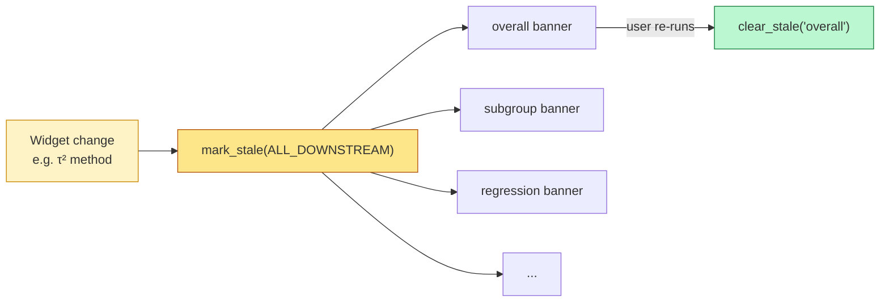
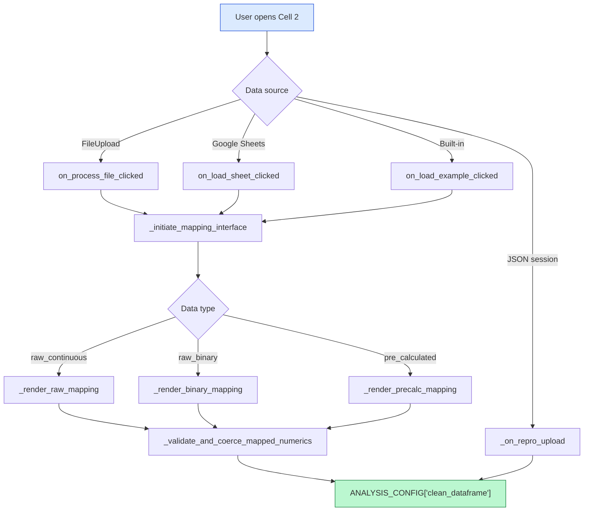
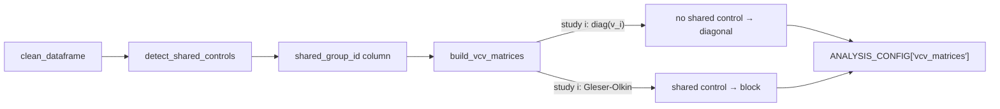
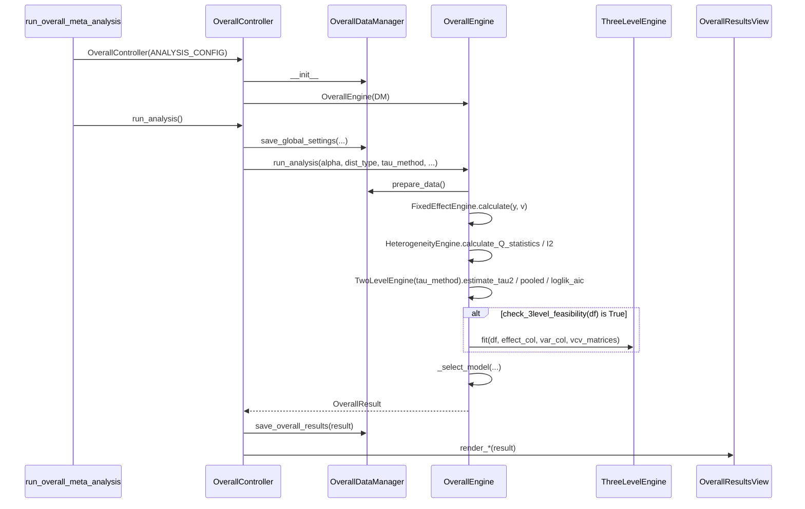
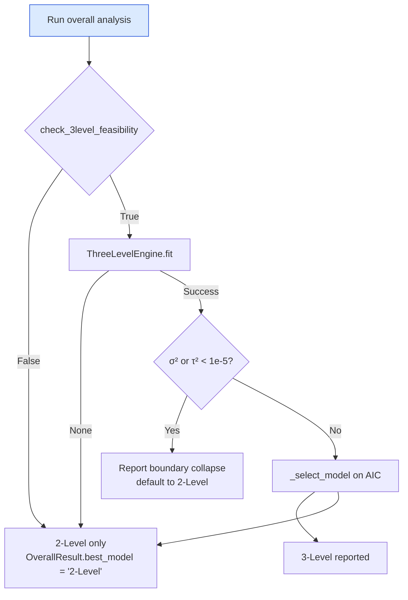
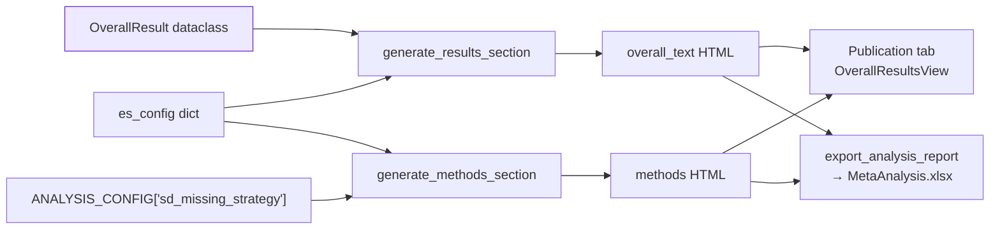

# CoMeta: Architecture and Data Flow

*A technical reference for the `CoMeta_1.ipynb` analytical pipeline.*

---

## 1. System Overview: The Notebook as an Application

CoMeta is implemented as a single linear Google Colab notebook (`CoMeta_1.ipynb`, 44 cells). Despite the notebook format, the codebase adheres to a strict **Model–View–Controller (MVC)** discipline within each analytical module: the *Model* is encapsulated in a `*DataManager`/`*Engine` pair, the *View* in a `*ResultsView` (a `widgets.Tab` renderer), and the *Controller* in a `*Controller` class that wires user widgets to the engine and pushes results into the view. The same triplet recurs in Cells 7 (`OverallDataManager`, `OverallEngine`, `OverallResultsView`, `OverallController`), 9 (`SubgroupDataManager`, `SubgroupAnalysisEngine`, `SubgroupController`), 12 (`RegressionDataManager`, `RegressionEngine`, `RegressionController`), and 14 (`SplineMetaRegressionController`).

### 1.1 Global state: `ANALYSIS_CONFIG`

All cross-cell state lives in a single module-level dictionary, `ANALYSIS_CONFIG`, initialised defensively at the top of every cell:

```python
if 'ANALYSIS_CONFIG' not in globals():
    ANALYSIS_CONFIG = {}
```

This dictionary is the canonical "Model" — every cell reads its inputs from `ANALYSIS_CONFIG` and writes its outputs back to it, ensuring that downstream cells can be executed independently as long as the upstream keys are present. Representative keys (in the order they appear in the pipeline):

| Stage | Key | Producer cell | Type |
|---|---|---|---|
| Ingestion | `clean_dataframe` | 2 | `pd.DataFrame` |
| Filtering | `prefilter_col`, `prefilter_values` | 3 | `str`, `list` |
| Cleaning | `removed_records`, `sd_missing_strategy`, `sd_zero_strategy`, `sd_log` | 4 | mixed |
| Effect sizes | `effect_size_type`, `es_config`, `effect_col`, `var_col`, `se_col` | 5/6 | mixed |
| VCV | `vcv_matrices` | 6 | `dict[study_id → np.ndarray]` |
| Analysis-ready | `analysis_data` | 6 | `pd.DataFrame` |
| Global settings | `global_settings` (`alpha`, `dist_type`, `tau_method`, `use_kh`, `model_choice`) | 7 | `dict` |
| Results | `overall_results`, `three_level_results`, `subgroup_results`, `meta_regression_RVE_results`, `spline_model_results`, `funnel_results`, `trimfill_results`, `pet_peese_results`, `cumulative_results`, `loo_3level_results` | 7–25 | `dict` |
| Generated text | `overall_text`, `subgroup_text`, `regression_text`, `bias_text`, `cumulative_text` | 7–18 | `str` |
| Provenance | `is_reproducing`, `data_type` | 2/end | `bool`/`str` |

Widgets do **not** hold persistent state. Each `*Controller` calls `data_manager.save_global_settings(...)`, `save_overall_results(...)`, etc., which mutates `ANALYSIS_CONFIG` in place.

### 1.2 Staleness propagation

Because the notebook is sequential but the user may re-run any upstream cell, every module registers an `ipywidgets.HTML` *stale banner* via `register_banner(module_id, banner_widget)` (Cell 1, lines 117–119). When upstream choices change, the affected cell calls:

```python
mark_stale(ALL_DOWNSTREAM, "Step 5: Effect Size Metric Changed")
```

`ALL_DOWNSTREAM = ['overall', 'subgroup', 'regression', 'spline', 'pub_bias', 'pet_peese', 'loo', 'cumulative', 'plots']` (Cell 1, line 146). The banner displays a yellow warning until the user re-runs the module, at which point the controller calls `clear_stale('overall')` (Cell 7, line 2622). This implements lazy invalidation in the absence of a reactive runtime.



---

## 2. Data Ingestion and Initialization (Cell 2)

Cell 2 (`#@title ⚙️ 2. Data Ingestion`) implements four mutually exclusive ingestion pathways behind a single `widgets.Dropdown` data-type selector. The unified output is a validated `pd.DataFrame` written to `ANALYSIS_CONFIG['clean_dataframe']`.

### 2.1 Ingestion pathways

| Source | Trigger | Handler |
|---|---|---|
| CSV / Excel upload | `widgets.FileUpload` → `on_file_upload(change)` → `on_process_file_clicked(b)` | `get_uploaded_file_data(uploader_widget)` extracts bytes, `_safe_read_csv(content_bytes)` parses with encoding fallback |
| Google Sheets | `on_auth_clicked(b)` → `on_fetch_ws_clicked(b)` → `on_load_sheet_clicked(b)` | Uses `gspread` to pull a worksheet by URL/ID |
| JSON session restore | `_on_repro_upload(change)` | Calls `load_reproducibility_config(json_bytes)` (Cell 1, line 2738), re-hydrating `clean_dataframe` from the embedded CSV and setting `is_reproducing=True` |
| Built-in examples | `widgets.Dropdown` populated from `BUILT_IN_DATASETS` → `on_load_example_clicked(b)` | Five hard-coded dictionaries: `BCG_DATA`, `NORMAND_DATA`, `KONST_DATA`, `RAUDENBUSH_DATA`, `CURTIS_DATA` |

The five built-in datasets are declared as Python dicts and exposed through:

```python
BUILT_IN_DATASETS = {
    'Binary (BCG Vaccine - Tuberculosis)':            {'data': BCG_DATA,        'type': 'raw_binary'},
    'Continuous (Normand 1999 - Stroke Rehab)':       {'data': NORMAND_DATA,    'type': 'raw_continuous'},
    '3-Level Pre-Calculated (Konstantopoulos 2011)':  {'data': KONST_DATA,      'type': 'pre_calculated'},
    'Meta-Regression / Splines (Raudenbush 1985)':    {'data': RAUDENBUSH_DATA, 'type': 'pre_calculated'},
    'Ecology Continuous (Curtis 1998 - Plant CO2)':   {'data': CURTIS_DATA,     'type': 'raw_continuous'},
}
```

### 2.2 Column mapping & validation

After loading, the user is presented with a column-mapping interface routed by `_initiate_mapping_interface(df)` → `_render_column_mapping(df, data_type)` to one of three branches:

* `_render_raw_mapping(df)` — continuous raw means/SDs/Ns, governed by the synonym table `RAW_COLUMN_SPECS` (keys: `id, xe, sde, ne, xc, sdc, nc`).
* `_render_binary_mapping(df)` — 2×2 tables, governed by `BINARY_COLUMN_SPECS` (keys: `id, events_e, nonevents_e, events_c, nonevents_c`).
* `_render_precalc_mapping(df)` — pre-calculated effect sizes, governed by `PRECALC_COLUMN_SPECS` (keys: `id, yi, variance, se, n_total`).

Optional geographic columns (`GEO_COLUMN_SPECS`: latitude, longitude, country) are mapped through `_build_geo_mapping_widgets(df)` and validated with `_validate_geo_data(df, geo_map)`.

Each mapping renderer performs two layers of validation before committing:

1. **`_check_duplicate_columns(df, source_label)`** — rejects DataFrames with duplicate column names.
2. **`_validate_and_coerce_mapped_numerics(df, col_map, data_type)`** — coerces numerics using the strict whitelist `_NUMERIC_REQUIRED` and the soft whitelist `_NUMERIC_SOFT`, falling back to `_coerce_numeric_columns(df)` for downstream usability.

On success the renderer writes the renamed, type-coerced frame to `ANALYSIS_CONFIG['clean_dataframe']` and calls `mark_stale(ALL_DOWNSTREAM, "Step 2: ... Mapping Changed")`.



---

## 3. Data Preparation and VCV Matrix Construction

### 3.1 Shared-control detection (Cell 4)

Cell 4 owns `detect_shared_controls(df)`, which flags within-study observations that re-use the same control arm. The function groups by `id` and hashes the control-group signature:

```python
# Continuous data
group['_control_key'] = (
    group['nc'].fillna(-999).astype(str) + '_' +
    group['xc'].fillna(-999).round(6).astype(str) + '_' +
    group['sdc'].fillna(-999).round(6).astype(str)
)
# Binary data
group['_control_key'] = (
    group['events_c'].fillna(-999).astype(str) + '_' +
    group['nonevents_c'].fillna(-999).astype(str)
)
```

Any group of ≥ 2 rows sharing the same key is assigned a unique tag `shared_group_id = f"{study_id}_shared_grp_{group_counter}"`. The function returns `(df, shared_count)`. The detector is invoked from the main cleaning pipeline at line 430 of Cell 4:

```python
data_filtered, n_shared = detect_shared_controls(data_filtered)
```

The resulting `shared_group_id` column is the bridge between data preparation and covariance modelling — it is the *only* signal the VCV builder uses to decide where off-diagonal entries belong.

### 3.2 Exact VCV construction (Cell 6 — `build_vcv_matrices`)

Cell 6 contains the closed-form Variance–Covariance constructor, declared in the source as:

> *"Construct variance–covariance (VCV) matrices for studies with shared control groups, using the exact formulae from Gleser & Olkin (2009)."*

```python
def build_vcv_matrices(df, effect_type, var_col_name,
                       yi_col='yi', nt_col='ne', nc_col='nc',
                       xc_col='xc', sdc_col='sdc',
                       events_c_col=None, nonevents_c_col=None):
```

The builder produces one block per `id`. Each study's block is initialised as a **diagonal matrix** of sampling variances (`np.diag(study_grp[var_col_name].values)`). It then iterates over rows whose `shared_group_id` is non-null and inserts the analytically derived covariance into every off-diagonal pair *(i, j)* within that shared cluster. Five closed-form covariances are implemented (Gleser & Olkin 2009, Table 4 and the response-ratio derivation of Lajeunesse 2011):

| `effect_type` | Off-diagonal covariance |
|---|---|
| `cohen_d` | `cov(d_i, d_j) = 1/nc + d_i·d_j·nc / (2·N_i·N_j)` where `N_i = nt_i + nc` |
| `hedges_g` | `J_i·J_j · [ 1/nc + (d_i·d_j·nc) / (2·N_i·N_j) ]` with `J = exp(gammaln(df/2) − ½·log(df/2) − gammaln((df−1)/2))` from `_hedges_j(df_val)` |
| `lnRR` | `sdc² / (nc · xc²)` |
| `log_or` | `1/c_c + 1/d_c` (shared control events / non-events) |
| `log_rr` | `1/c_c − 1/n_c` (shared control events / total) |

The output is a dictionary keyed by `study_id`:

```python
vcv_matrices = {}
...
vcv_matrices[study_id] = vcv     # np.ndarray, shape (k_i, k_i)
return vcv_matrices
```

`build_vcv_matrices` is called once at the end of Cell 6 and persisted globally:

```python
vcv_matrices = build_vcv_matrices(df, effect_size_type, var_col, **vcv_kwargs)
ANALYSIS_CONFIG['vcv_matrices'] = vcv_matrices
ANALYSIS_CONFIG['analysis_data'] = df
```

Studies that never matched a `shared_group_id` retain the pure-diagonal block, and pre-calculated workflows missing the raw count columns silently fall back to the diagonal identity (line 67 of Cell 6) — these are the only conditions under which the block deviates from the exact Gleser–Olkin form.

The full block-diagonal *VCV matrix* of the dataset is never instantiated as a single `(N × N)` array; the engine operates on the per-study list in study-order, which makes Sherman–Morrison and Cholesky shortcuts cheap (see § 4.2).



---

## 4. The Statistical Engine Flow (Cells 1 + 7 + 12)

The statistical core is split between **Cell 1** (low-level math primitives, REML log-likelihoods, robust SE) and **Cell 7** (orchestration, model selection, reporting). Cells 9 (subgroup), 12 (meta-regression) and 14 (splines) re-use the same primitives.

### 4.1 Three-level orchestration (`OverallEngine.run_analysis`)



### 4.2 Three-level REML core (`ThreeLevelEngine.fit`, Cell 7 lines 740–1099)

`fit()` consumes the dataframe, the effect / variance columns, and the global VCV dictionary. After sorting by `id` and building parallel lists `y_all`, `vcv_all`, it constructs the per-study negative log-likelihood closure `nll(params)` where `params = [τ², σ²]`. The likelihood marginalises the pooled mean analytically; the Σᵢ matrix for study *i* is

```
Σ_i = V_i + σ²·I_k + τ²·1·1ᵀ
```

with two fast paths:

| Path | Trigger | Math |
|---|---|---|
| Sherman–Morrison | `V_i` is diagonal (no shared control in study *i*) | Closed-form rank-1 update using `A_inv = 1/(v + σ²)`, `denom = 1 + τ²·sum(A_inv)` |
| Full Cholesky | `V_i` has off-diagonal entries | `np.linalg.cholesky(Σ_i)`; falls back to `np.linalg.pinv` on `LinAlgError` |

The optimiser is a deterministic **multi-start L-BFGS-B**:

```python
start_points = [[0.01, 0.01], [0.1, 0.1], [0.5, 0.5],
                [1.0, 1.0],   [1.0, 0.1], [0.1, 1.0]]
for start in start_points:
    res = minimize(nll, start,
                   bounds=[(1e-8, None)]*2,
                   method='L-BFGS-B',
                   options={'ftol': 1e-11})
```

Profile-likelihood confidence intervals for both variance components are obtained via `brentq` root-finding on `profile_nll_tau2(t2)` / `profile_nll_sigma2(s2)` at the canonical threshold `LL_THRESHOLD = 1.9208` (½·χ²₁(0.95)), with the conjugate variance re-optimised at each candidate. When the profile is flat, the upper bound is honestly reported as `np.inf` rather than capped.

`fit()` returns a dictionary including `mu`, `se`, `tau2`, `sigma2`, `tau2_ci_lower/upper`, `sigma2_ci_lower/upper`, `icc_l3`, `icc_l2`, `aic`, `log_lik_reml`, `pi_lower`, `pi_upper`. These are then funnelled through `OverallResult` (dataclass, Cell 7 lines 52–115) and serialised by `OverallDataManager.save_overall_results(result)` into `ANALYSIS_CONFIG['three_level_results']`.

### 4.3 Three-level meta-regression and CR2 cluster-robust variance (Cell 1)

For models with moderators, `_run_three_level_reml_regression_v2(analysis_data, moderator_col, effect_col, var_col)` (Cell 1, line 1402) implements a documented **Plan A → B → C fallback strategy**:

* **Plan A — Full 3-Level GLS with VCV matrices.** Triggered when any study block is non-diagonal. Minimises `_neg_log_lik_reml_reg` (or `_neg_log_lik_reml_reg_constrained` when the moderator is study-constant) under L-BFGS-B with five start points, then polishes with `Nelder-Mead`.
* **Plan B — 3-Level GLS with Diagonal.** Same optimiser, but with `vcv_all_diag = [np.diag(v_i)]` substituted for the matrix list; used when Plan A fails to converge.
* **Plan C — Aggregated 2-Level Regression.** When the moderator is constant within study (`is_constant_within=True`) and 3-level plans fail, `_run_aggregated_2level_regression(y_all, vcv_all, X_all, M_studies, tau_sq_prior)` collapses each study to a precision-weighted mean and runs a classical 2-level meta-regression. The function returns a `plan_c_result` dictionary tagged `model_type = "2-Level Aggregated (Fallback)"`.

The fixed-effects β and naive `cov_beta` come from `_get_gls_estimates(params, y_all, vcv_all, X_all, N_total, M_studies, p_params)`. The robust inference is then delegated to:

```python
var_betas_robust, dfs_robust = _compute_robust_var_betas(
    betas, y_all, final_vcv, X_all,
    final_est['tau_sq'], final_est['sigma_sq']
)
```

#### `_compute_robust_var_betas` (Cell 1, lines 1899–2049)

This routine implements **CR2 (bias-reduced linearisation)** cluster-robust variance with **Satterthwaite degrees of freedom**, following Pustejovsky & Tipton (2018):

1. **Bread.** First pass: build `Σ_i = V_i + σ²·I_k + τ²·1·1ᵀ`, invert (with `np.linalg.pinv` fallback), and accumulate `sum_Xt_invS_X = Σᵢ Xᵢᵀ Σᵢ⁻¹ Xᵢ`. `bread_inv = inv(sum_Xt_invS_X)`.
2. **CR2 adjustment.** For each study compute the hat-matrix block `H_ii = X_i · bread_inv · (Σ_i⁻¹ X_i)ᵀ`, symmetrise `D_i = I − H_ii`, eigendecompose `eigh(D_i)`, floor eigenvalues at `max(1e-10, 1e-6·max|λ|)`, and form the adjustment `A_i = D_i^{-1/2}`.
3. **Meat.** Adjusted residuals `e* = A_i · e_i` feed `g_i = X_iᵀ · Σ_i⁻¹ · e*`; the meat is `Σᵢ g_i g_iᵀ`.
4. **Sandwich.** `var_robust = bread_inv · meat · bread_inv`.
5. **Satterthwaite DF.** For contrast vector `c_j` (jth coefficient), pre-cache `B_i = A_i · Σ_i · A_iᵀ` and `q_i = (Σ_i⁻¹ X_i) · bread_inv · c_j`. Then `g_ij = q_iᵀ B_i q_i` and `df_j = (Σᵢ g_ij)² / Σᵢ g_ij²`, clipped to `[1, M_studies − 1]`. (Implements Pustejovsky & Tipton 2018, eq. 6.)

The function returns `(var_robust, df_vec)`; downstream code uses `df_vec` to compute `t_stats = betas / se_betas`, `p_values = 2·(1 − t.cdf(|t|, df))`, and CIs with `t.ppf(1 − α/2, df)` — i.e. *every* coefficient is tested against its own Satterthwaite-corrected reference distribution.

### 4.4 Library stack

The engine is built exclusively on **NumPy / SciPy / pandas**:

| Library | Role |
|---|---|
| `numpy` | All linear algebra (`np.linalg.cholesky`, `pinv`, `slogdet`, `eigh`), array shaping, broadcasting |
| `scipy.optimize.minimize` (L-BFGS-B, Nelder-Mead) | REML maximisation |
| `scipy.optimize.minimize_scalar` (bounded) | Profile-likelihood conjugate optimisation |
| `scipy.optimize.brentq` | Root-finding for profile-likelihood CI |
| `scipy.stats.norm`, `scipy.stats.t`, `scipy.stats.chi2` | Critical values, p-values, Q-test |
| `scipy.special.gammaln`, `scipy.special.gamma` | Exact Hedges' J correction in `_hedges_j(df_val)` |
| `patsy` | Spline / formula design matrices in `_run_robust_spline_analysis(df, moderator_col, effect_col, var_col, df_spline=3)` (Cell 1, line 2051), e.g. `patsy.dmatrix(formula, {"x": mod_vals}, return_type='matrix')` |
| `pandas` | DataFrame I/O, grouping, alignment |
| `ipywidgets` | UI layer |
| `xlsxwriter`, `gspread` | Export & Google Sheets ingestion |

### 4.5 Fallback mechanisms

Convergence and feasibility failures cascade gracefully:

1. **Topological pre-check.** `OverallDataManager.check_3level_feasibility(df)` returns `False` unless `df['id'].nunique() < len(df)` *and* at least two studies have ≥ 2 effect sizes — the structural minimum to identify σ². If `False`, the engine never invokes `ThreeLevelEngine.fit` and reports the 2-level fit.
2. **Variance-boundary collapse.** Inside `OverallPublicationTextGenerator.generate_results_section`, if either `result.sigma_squared_3level < 1e-5` or `result.tau_squared_3level < 1e-5`, the published narrative explicitly states *"variance partitioning resulted in a parameter boundary collapse … the algorithm defaulted to the more parsimonious two-level random-effects model."*
3. **Optimiser failure.** If `ThreeLevelEngine.fit` returns `None` (all six start points fail), `has_3level` remains `False` and only the 2-level result is committed.
4. **Meta-regression Plan A → B → C.** Documented in § 4.3.
5. **CR2 numerical failure.** If `_compute_robust_var_betas` raises (`LinAlgError`, `ValueError`), the caller substitutes `final_est['cov_beta']` (the naive GLS covariance) and reverts the DF vector to `max(1, M_studies − p_params)`.
6. **τ² estimator fallback.** `TwoLevelEngine.estimate_tau2` falls back from REML/ML to DerSimonian–Laird if `calculate_tau_squared(df, effect_col, var_col, method=…)` is missing or raises.



---

## 5. Session Serialization & Reporting

### 5.1 JSON serialization (Cell 1, lines 2629–2768)

Three functions implement the reproducibility round-trip:

* **`make_json_safe(obj)`** — recursive coercion: `np.integer → int`, `np.floating → float`, `np.ndarray → list`, `np.bool_ → bool`, `datetime → ISO string`, `pd.DataFrame → None` (skipped here; embedded later), and `set → sorted(list)`. Anything that fails `json.dumps` is stringified.
* **`export_config_for_reproducibility(analysis_config)`** — builds an export dict with the following enforced shape:

```python
clean['_reproducibility'] = {
    'is_reproducing': True,
    'exported_at':   datetime.now().isoformat(),
    'co_met_version': '8.0',
    'strategy':       'sequential_auto_populate',
}
SKIP_KEYS = RESULT_KEYS | {'clean_dataframe'}
clean['global_settings']   = make_json_safe(gs)         # surfaced at top
clean['subgroup_config']   = make_json_safe(...)         # surfaced at top
# Then copy every other INPUT key (skipping RESULT_KEYS)
# Then surface orphan defaults: custom_cv, zero_offset_*, spline_config,
#   regression_config, bias_config, pet_peese_config, cumulative_config
clean['_optimizer_defaults'] = { reml_max_iter, reml_tol, 3level_optimizer_ftol, ... }
# Finally embed clean_dataframe as CSV at the bottom
df.to_csv(csv_buffer, index=False)
clean['embedded_data'] = csv_buffer.getvalue()
```

The skip list is the canonical `RESULT_KEYS` set:

```python
RESULT_KEYS = {
    'analysis_data', 'removed_records', 'vcv_matrices',
    'overall_results', 'three_level_results', 'subgroup_results',
    'meta_regression_RVE_results', 'spline_model_results',
    'funnel_results', 'trimfill_results', 'pet_peese_results',
    'cumulative_results', 'loo_results', 'loo_3level_results',
    'overall_text', 'subgroup_text', 'regression_text',
    'bias_text', 'cumulative_text', 'cumulative_metadata',
}
```

This design separates **inputs** (preserved in JSON, used to *re-derive* outputs) from **results** (recomputed deterministically downstream from the same inputs), guaranteeing that loading a session never injects stale numbers.

* **`load_reproducibility_config(json_path_or_bytes)`** — the inverse: parses the JSON, pops `embedded_data`, calls `pd.read_csv(io.StringIO(csv_string))`, writes `config['clean_dataframe'] = df`, exposes `globals()['raw_data_standardized']`, and sets `config['is_reproducing'] = True`. Every downstream controller then checks `ANALYSIS_CONFIG.get('is_reproducing', False)` and silently re-applies stored widget values via `_safe_set_widget(widget, value, observer_fn, observer_name)`.

### 5.2 Automated Materials & Methods / Results generator

Each analytical cell exposes a publication-text class — for the overall model this is `OverallPublicationTextGenerator` (Cell 7, lines 1657 onward), which renders two HTML fragments injected into the *Publication* tab of `OverallResultsView`.

#### `generate_methods_section(es_config, use_kh)`

1. **Citation database `db`.** Hard-coded dictionary of canonical references (Hedges 1981, Hedges/Gurevitch/Curtis 1999 for lnRR, Viechtbauer 2005 for REML, Higgins & Thompson 2002 for I², Knapp & Hartung 2003, SciPy/Virtanen 2020, etc.).
2. **Dynamic reference list `active_refs`.** Citations are appended *conditionally*: effect-size citation chosen by inspecting `es_config['type']` and `es_config['effect_label']`; Sweeting et al. (2004) appended only for `log_or` / `log_rr`; Knapp–Hartung appended only if `use_kh=True`. The reference indices are stored as `ref_es`, `ref_reml`, `ref_kh`, `ref_py`, `ref_tool` and interpolated into the prose.
3. **Conditional disclosures.** The function reads `ANALYSIS_CONFIG.get('sd_missing_strategy', 'none')` and appends an explicit caveat ("treating imputed variances as known parameters may slightly underestimate the true uncertainty …") when imputation was performed.

#### `generate_results_section(result, es_config)`

Reads from the `OverallResult` dataclass and emits a fully-formed Results paragraph:

* Selects the reporting target (`mu_p = result.mu_random if result.best_model == "2-Level" else result.mu_3level`); same triage for `ci_lo_p`, `ci_hi_p`, `p_p`.
* **Effect-size description** chosen from a literal lookup `es_map` keyed on `es_config['type']`.
* **Significance / formatting** — `sig_text = "significant" if p_p < 0.05 else "non-significant"`; `p_format = "< 0.001" if p_p < 0.001 else f"= {p_p:.3f}"`.
* **Magnitude interpretation** — Cohen-style bins on `abs(mu_p)` (`< 0.2` negligible, `< 0.5` small, `< 0.8` moderate, else large); for `log_or` / `log_rr`, bins on `exp(|μ|)` (`< 1.5`, `< 3.0`, ≥ 3.0).
* **Heterogeneity interpretation** — Higgins-style bins on `result.I2` (`< 25`, `< 50`, `< 75`, else considerable).
* **Model-selection narrative** — three branches gated on `result.best_model`, `delta_aic = abs(aic_2level − aic_3level)`, and `variance_collapsed = (sigma_squared_3level < 1e-5) or (tau_squared_3level < 1e-5)`.

The final HTML is committed via `OverallDataManager.save_publication_text(text)` → `ANALYSIS_CONFIG['overall_text']`, which is what the Excel exporter (`export_analysis_report(report_type, filename_prefix)`, Cell 1 line 2397) ships in the "Publication Text" sheet alongside the protocol metadata captured by `_get_protocol_metadata(report_type)`.



---

## 6. Extension Guide: Adding a New Analytical Module

Follow the canonical `Manager / Engine / View / Controller` pattern used by every existing cell. A new module *N* should consume `ANALYSIS_CONFIG['analysis_data']`, `ANALYSIS_CONFIG['vcv_matrices']`, and `ANALYSIS_CONFIG['global_settings']`, and must write its outputs back under a single namespaced key, e.g. `ANALYSIS_CONFIG['mymodule_results']`.

### 6.1 Reading the global dataframe and VCV

```python
# Inside MyModuleDataManager (mirroring OverallDataManager)
class MyModuleDataManager:
    def __init__(self, analysis_config):
        self._config = analysis_config

    @property
    def analysis_data(self):
        df = self._config.get('analysis_data')
        return df.copy() if df is not None else None

    @property
    def effect_col(self):
        return self._config.get('effect_col', 'hedges_g')

    @property
    def var_col(self):
        return self._config.get('var_col', 'Vg')

    @property
    def vcv_matrices(self):
        return self._config.get('vcv_matrices', {})

    def save_results(self, payload: dict):
        self._config['mymodule_results'] = payload
```

### 6.2 Engine wiring (re-using primitives)

Re-use the existing Cell 1 primitives rather than re-implementing them:

```python
class MyModuleEngine:
    def __init__(self, data_manager):
        self.dm = data_manager

    def fit(self, alpha=0.05, dist_type='t'):
        df = self.dm.analysis_data
        df = df.sort_values('id').reset_index(drop=True)

        # Three-level regression with CR2 — same pattern as Cells 9 / 12
        final_est, info, opt = _run_three_level_reml_regression_v2(
            df, moderator_col='my_predictor',
            effect_col=self.dm.effect_col, var_col=self.dm.var_col
        )

        # CR2 + Satterthwaite are already inside _run_three_level_reml_regression_v2,
        # but you can also call _compute_robust_var_betas directly if you build
        # X_all / vcv_all manually.
        return final_est
```

If your module needs a *new* design matrix (e.g. splines, polynomials, interactions), follow `_run_robust_spline_analysis(df, moderator_col, effect_col, var_col, df_spline=3)` (Cell 1, line 2051), which builds a `patsy.dmatrix` basis and then calls `_compute_robust_var_betas` on the resulting `X_all`.

### 6.3 Binding to the UI

```python
class MyModuleController:
    def __init__(self, analysis_config):
        self.dm = MyModuleDataManager(analysis_config)
        self.engine = MyModuleEngine(self.dm)
        self.view = MyModuleResultsView()      # render() methods write into widgets.Output tabs

        # Register staleness banner
        self.stale_banner = widgets.HTML(value="")
        register_banner('mymodule', self.stale_banner)

        # Configurable widgets — observers MUST mark downstream cells stale
        self.alpha_widget = widgets.Dropdown(
            options=[('95% CI', 0.05), ('99% CI', 0.01)],
            value=0.05, description='Confidence:'
        )
        self.run_button = widgets.Button(description='Run Analysis')
        self.run_button.on_click(self._on_run_clicked)

    def _on_run_clicked(self, b):
        result = self.engine.fit(alpha=self.alpha_widget.value)
        self.dm.save_results(result)
        clear_stale('mymodule')
        mark_stale(['plots'], "MyModule Re-run")
        self.view.render(result)

def run_mymodule():
    if 'ANALYSIS_CONFIG' not in globals():
        display(HTML("<b>Run Cells 1–6 first.</b>"))
        return
    ctl = MyModuleController(ANALYSIS_CONFIG)
    display(widgets.VBox([ctl.stale_banner, ctl.alpha_widget,
                          ctl.run_button, ctl.view.tabs]))
    # Optional: auto-execute under reproducibility mode
    if ANALYSIS_CONFIG.get('is_reproducing', False):
        ctl._on_run_clicked(None)

run_mymodule()
```

### 6.4 Reporting and serialisation

* Always coerce numerics with `make_json_safe(...)` before writing to `ANALYSIS_CONFIG` if your result dictionary may contain numpy types.
* Add your new result key to the `RESULT_KEYS` set inside `export_config_for_reproducibility` (Cell 1) so it is *not* serialised; only inputs (widget values, configuration) belong in the JSON.
* If you want your module to appear in the Excel export, add a branch in `_get_protocol_metadata(report_type)` and call `export_analysis_report(report_type='mymodule', filename_prefix='MyModule')`.
* Provide a `MyModulePublicationTextGenerator` that consumes the result object and produces an HTML fragment, then save with `self.dm._config['mymodule_text'] = html` — the same pattern used by `OverallPublicationTextGenerator` and `generate_methods_section` / `generate_results_section`.

Following this contract, a new analytical module integrates with the existing staleness propagation, JSON round-trip, Excel export, and publication-text generation with no further changes elsewhere in the notebook.

---

## Appendix A — Key file map

| Cell | Title | Key entities |
|---|---|---|
| 1 | Environment Setup & Core Functions | `calculate_tau_squared_*`, `_hedges_j`, `_get_three_level_estimates`, `_run_three_level_reml_regression_v2`, `_run_aggregated_2level_regression`, `_compute_robust_var_betas`, `_run_robust_spline_analysis`, `export_analysis_report`, `make_json_safe`, `export_config_for_reproducibility`, `load_reproducibility_config`, `register_banner` / `mark_stale` / `clear_stale` |
| 2 | Data Ingestion | `RAW_COLUMN_SPECS`, `BINARY_COLUMN_SPECS`, `PRECALC_COLUMN_SPECS`, `GEO_COLUMN_SPECS`, `BUILT_IN_DATASETS`, `_safe_read_csv`, `_validate_and_coerce_mapped_numerics`, `_initiate_mapping_interface`, `on_*_clicked` handlers |
| 3 | Global Filtering | `prefilter_col`, `prefilter_values` |
| 4 | Data Cleaning & Pre-processing | `detect_shared_controls`, SD imputation helpers |
| 5 | Effect Size Selection & Diagnostics | `es_configs` dispatch table, `effect_size_type` |
| 6 | Effect Size Calculation | `build_vcv_matrices` (Gleser & Olkin 2009) |
| 7 | Overall Meta-Analysis | `OverallConfig`, `OverallResult`, `OverallDataManager`, `FixedEffectEngine`, `HeterogeneityEngine`, `TwoLevelEngine`, `ThreeLevelEngine`, `OverallEngine`, `OverallPublicationTextGenerator`, `OverallResultsView`, `OverallController` |
| 8 | Subgroup Configuration | `subgroup_config` |
| 9 | Subgroup Execution | `SubgroupDataManager`, `SubgroupAnalysisEngine`, `SubgroupController` |
| 10–11 | Forest / Orchard plots | view-only |
| 12 | Meta-Regression | `RegressionDataManager`, `TwoLevelRegressionEngine`, `ThreeLevelRegressionEngine`, `RegressionEngine`, `RegressionController` |
| 14 | Spline Meta-Regression | `SplineMetaRegressionController`, `_run_robust_spline_analysis` |
| 16–19 | Publication bias | Egger / Trim-fill / PET-PEESE / Funnel |
| 20–22 | Sensitivity (LOO, Baujat) | `loo_3level_results` |
| 23–25 | Cumulative / Geographic | `cumulative_results` |
| 26–43 | Validation suite | `ipytest` unit tests + Python-vs-R Monte Carlo cross-checks |

## Appendix B — Bibliography of methods implemented

* Gleser, L. J., & Olkin, I. (2009). *Stochastically dependent effect sizes.* In *The Handbook of Research Synthesis and Meta-Analysis* (Table 4 of the chapter is the source of the shared-control closed forms in § 3.2).
* Pustejovsky, J. E., & Tipton, E. (2018). *Small-sample methods for cluster-robust variance estimation and hypothesis testing in fixed effects models.* Implemented verbatim in `_compute_robust_var_betas`, including the Satterthwaite contrast formula `df_j = (Σᵢ g_ij)² / Σᵢ g_ij²`.
* Knapp, G., & Hartung, J. (2003). *Improved tests for a random effects meta-regression with a single covariate.* Toggle: `OverallController.use_kh_widget`.
* Viechtbauer, W. (2005). REML estimator behaviour; the default `tau_method='REML'` in `TwoLevelEngine` and `ThreeLevelEngine`.
* Higgins, J. P., & Thompson, S. G. (2002). *I² heterogeneity statistic*; `HeterogeneityEngine.calculate_I2`.
* Lajeunesse, M. J. (2011). lnRR shared-control covariance; the `effect_type == 'lnRR'` branch of `build_vcv_matrices`.
